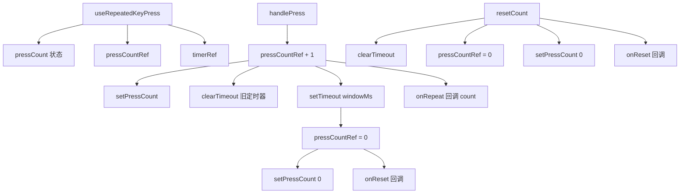

# useRepeatedKeyPress.ts

> 检测在时间窗口内的重复按键次数，支持回调和自动重置

## 概述

`useRepeatedKeyPress` 是一个 React Hook，用于检测用户在指定时间窗口内重复按下同一键的次数。典型用例：连按两次 Ctrl+Z 触发挂起功能。

它在每次按键时重置超时计时器，超时后自动清零计数。同时通过 `onRepeat` 和 `onReset` 回调通知状态变化。

## 架构图（mermaid）

## 主要导出

| 导出名 | 类型 | 说明 |
|--------|------|------|
| `UseRepeatedKeyPressOptions` | `interface` | `{ onRepeat?, onReset?, windowMs }` |
| `useRepeatedKeyPress` | `(options) => { pressCount, handlePress, resetCount }` | 返回计数和操作函数 |

## 核心逻辑

1. `handlePress`：递增计数、重置定时器、调用 `onRepeat(newCount)`、返回新计数。
2. 超时后自动重置计数为 0 并调用 `onReset`。
3. `resetCount`：手动重置计数和定时器。
4. `optionsRef` 避免回调函数的闭包陈旧问题。
5. 组件卸载时清理定时器。

## 内部依赖

无。

## 外部依赖

| 依赖 | 说明 |
|------|------|
| `react` | `useRef`, `useCallback`, `useEffect`, `useState` |
