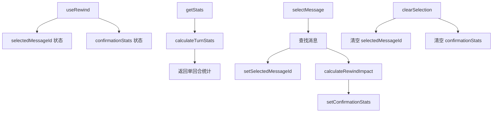

# useRewind.ts

> 管理会话回退（Rewind）功能的状态，包含回合统计和文件变更影响计算

## 概述

`useRewind` 是一个 React Hook，为会话回退功能提供状态管理。用户可以选择一条历史用户消息，回退到该时间点的会话状态。Hook 提供：

1. 选中消息的状态管理。
2. 每个回合的文件变更统计（`getStats`）。
3. 回退操作的文件影响预估（`confirmationStats`）。

## 架构图（mermaid）

## 主要导出

| 导出名 | 类型 | 说明 |
|--------|------|------|
| `useRewind` | `(conversation: ConversationRecord) => { selectedMessageId, getStats, confirmationStats, selectMessage, clearSelection }` | 返回回退状态和操作函数 |

## 核心逻辑

1. `getStats(userMessage)`：调用 `calculateTurnStats` 计算指定用户消息对应回合的文件变更统计。
2. `selectMessage(messageId)`：查找消息记录，设置选中 ID，调用 `calculateRewindImpact` 计算回退到该消息时所有后续变更的影响。
3. `clearSelection`：清空选中状态和统计结果。
4. 所有函数使用 `useCallback` 缓存，依赖 `conversation`。

## 内部依赖

| 依赖 | 路径 | 说明 |
|------|------|------|
| `calculateTurnStats`, `calculateRewindImpact` | `../utils/rewindFileOps.js` | 回退文件操作统计 |
| `FileChangeStats` | `../utils/rewindFileOps.js` | 文件变更统计类型 |

## 外部依赖

| 依赖 | 说明 |
|------|------|
| `react` | `useState`, `useCallback` |
| `@google/gemini-cli-core` | `ConversationRecord`, `MessageRecord` |
