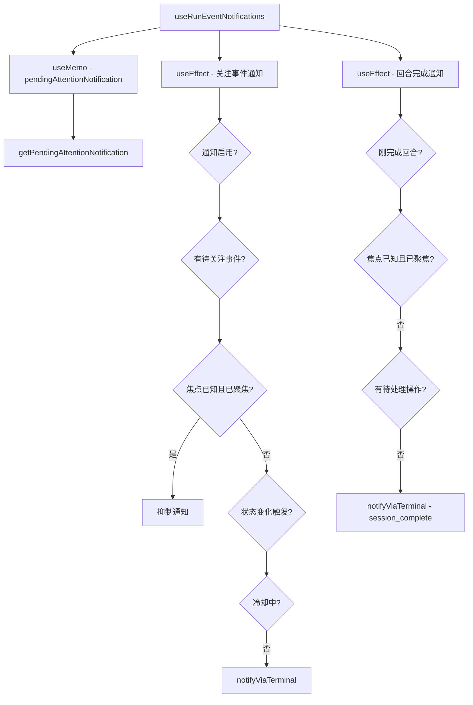

# useRunEventNotifications.ts

> 在终端失焦或需要关注时发送系统通知（如回合完成、等待确认）

## 概述

`useRunEventNotifications` 是一个 React Hook，管理 Gemini CLI 的终端通知发送逻辑。它在两种场景下发送通知：

1. **需要关注的事件**：当存在待处理的工具确认、权限确认、扩展更新确认或循环检测确认时。
2. **回合完成**：当 AI 响应从 Responding 变为 Idle 时。

通知发送受多重条件控制：焦点状态、冷却时间（20 秒）、是否支持焦点检测等。

## 架构图（mermaid）

## 主要导出

| 导出名 | 类型 | 说明 |
|--------|------|------|
| `useRunEventNotifications` | `(params: RunEventNotificationParams) => void` | 通知管理 Hook |

## 核心逻辑

1. **关注事件通知** 触发条件（满足任一）：
   - 刚进入需要关注的状态（`justEnteredAttentionState`）。
   - 刚失去焦点（`justLostFocus`）。
   - 关注事件的 key 发生变化。
2. **冷却机制**：同一 key 的通知在 20 秒内不重复发送。
3. **焦点抑制**：如果终端支持焦点检测（`hasReceivedFocusEvent`）且当前聚焦，则抑制通知。
4. **回合完成通知**：检测 `Responding -> Idle` 转换，排除已聚焦和有待处理操作的情况。
5. `pendingAttentionNotification` 通过 `useMemo` 从多个待处理请求中计算得出。

## 内部依赖

| 依赖 | 路径 | 说明 |
|------|------|------|
| `StreamingState` 等 | `../types.js` | 类型定义 |
| `getPendingAttentionNotification` | `../utils/pendingAttentionNotification.js` | 待关注事件提取 |
| `buildRunEventNotificationContent`, `notifyViaTerminal` | `../../utils/terminalNotifications.js` | 通知构建和发送 |

## 外部依赖

| 依赖 | 说明 |
|------|------|
| `react` | `useEffect`, `useMemo`, `useRef` |
