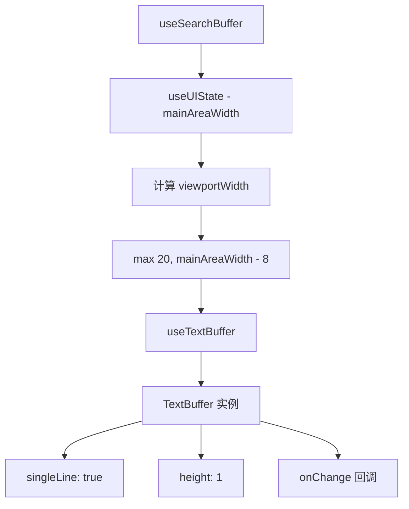

# useSearchBuffer.ts

> 创建单行搜索输入的 TextBuffer，自适应主区域宽度

## 概述

`useSearchBuffer` 是一个 React Hook，为搜索输入框创建配置好的 `TextBuffer` 实例。它从 UI 状态上下文获取 `mainAreaWidth`，计算视口宽度（减去偏移量，最小 20），然后创建一个单行、指定宽度的文本缓冲区。

## 架构图（mermaid）

## 主要导出

| 导出名 | 类型 | 说明 |
|--------|------|------|
| `UseSearchBufferProps` | `interface` | `{ initialText?, onChange }` |
| `useSearchBuffer` | `(props) => TextBuffer` | 返回配置好的 TextBuffer |

## 核心逻辑

1. 从 `useUIState()` 获取 `mainAreaWidth`。
2. 视口宽度 = `Math.max(20, mainAreaWidth - 8)`，减 8 为边框/标签留出空间。
3. 使用 `useTextBuffer` 创建单行缓冲区，初始光标偏移设为文本末尾。

## 内部依赖

| 依赖 | 路径 | 说明 |
|------|------|------|
| `useTextBuffer`, `TextBuffer` | `../components/shared/text-buffer.js` | 文本缓冲区 Hook 和类型 |
| `useUIState` | `../contexts/UIStateContext.js` | UI 状态上下文 |

## 外部依赖

无（仅依赖内部模块）。
