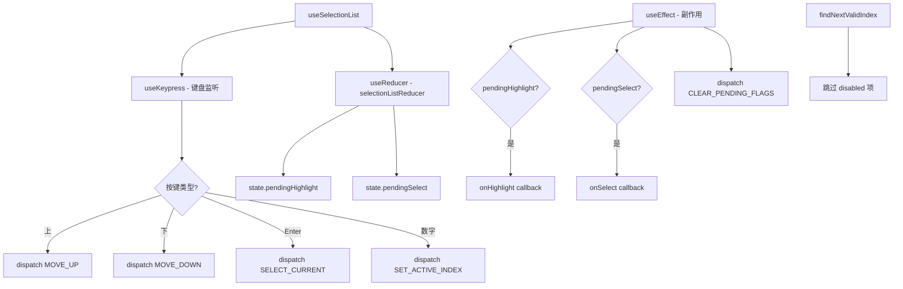

# useSelectionList.ts

> 无头（Headless）键盘导航选择列表，支持上下导航、回车选择和数字快捷键

## 概述

`useSelectionList` 是一个无头（Headless）React Hook，为列表选择组件（单选框、菜单等）提供键盘交互逻辑。它与 UI 渲染完全分离，仅管理状态和事件。

主要特性：
- 上/下键和 j/k 键导航
- Enter 键选择
- 数字快捷键（1-9 直接跳转）
- 禁用项自动跳过
- 可选的首尾循环（`wrapAround`）
- 通过 `focusKey` 实现编程式焦点控制
- 通过 `onHighlight` 和 `onSelect` 回调通知外部

内部使用 `useReducer` 管理状态，将副作用（回调调用）延迟到 `useEffect` 中执行。

## 架构图（mermaid）

## 主要导出

| 导出名 | 类型 | 说明 |
|--------|------|------|
| `SelectionListItem<T>` | `interface` | `{ key, value, disabled?, hideNumber? }` |
| `UseSelectionListOptions<T>` | `interface` | 完整配置选项 |
| `UseSelectionListResult` | `interface` | `{ activeIndex, setActiveIndex }` |
| `useSelectionList` | `<T>(options) => UseSelectionListResult` | 返回当前索引和设置函数 |

## 核心逻辑

1. **Reducer 状态机**：6 种 action（SET_ACTIVE_INDEX, MOVE_UP, MOVE_DOWN, SELECT_CURRENT, INITIALIZE, CLEAR_PENDING_FLAGS）。
2. **findNextValidIndex**：在给定方向上查找下一个非禁用项，支持循环和非循环模式。
3. **数字快捷键**：支持多位数输入（如 12 选择第 12 项），1 秒超时后自动选择。如果当前数字后追加 0 超出范围则立即选择。
4. **INITIALIZE**：当 items 或 initialIndex 变化时重新初始化，尝试保持当前活跃项。
5. **pendingHighlight/pendingSelect**：使用标志位将副作用推迟到 `useEffect`，避免在 reducer 中直接调用回调。

## 内部依赖

| 依赖 | 路径 | 说明 |
|------|------|------|
| `useKeypress`, `Key` | `./useKeypress.js` | 键盘事件 |
| `Command` | `../key/keyMatchers.js` | 命令枚举 |
| `useKeyMatchers` | `./useKeyMatchers.js` | 按键匹配 |
| `debugLogger` | `@google/gemini-cli-core` | 日志记录 |

## 外部依赖

| 依赖 | 说明 |
|------|------|
| `react` | `useReducer`, `useRef`, `useEffect`, `useCallback` |
| `@google/gemini-cli-core` | `debugLogger` |
