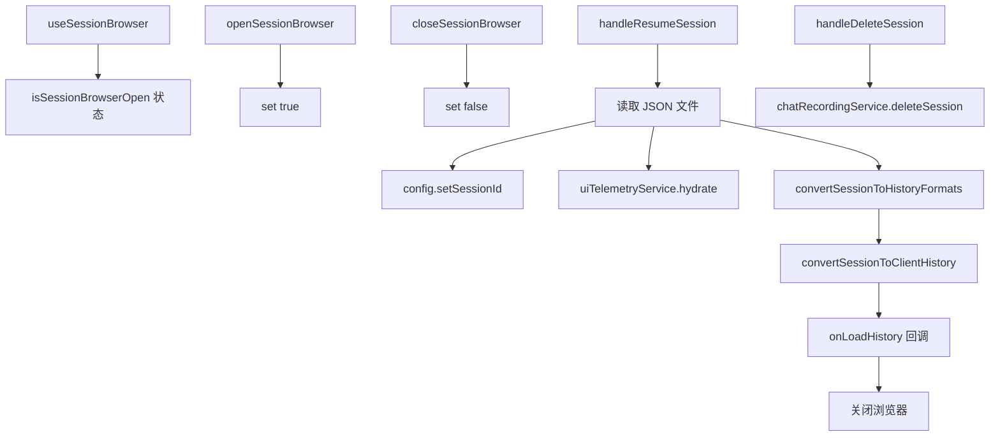

# useSessionBrowser.ts

> 管理会话浏览器的打开/关闭、会话恢复和会话删除功能

## 概述

`useSessionBrowser` 是一个 React Hook，为会话浏览器（Session Browser）UI 组件提供状态和操作。会话浏览器允许用户浏览、恢复和删除历史聊天会话。

核心功能：
1. 浏览器的打开/关闭状态管理。
2. `handleResumeSession`：从磁盘加载会话文件，转换为 UI 和客户端历史格式，恢复会话。
3. `handleDeleteSession`：通过 `ChatRecordingService` 删除会话。

## 架构图（mermaid）

## 主要导出

| 导出名 | 类型 | 说明 |
|--------|------|------|
| `convertSessionToHistoryFormats` | re-export | 会话转历史格式工具函数 |
| `useSessionBrowser` | `(config, onLoadHistory) => { isSessionBrowserOpen, openSessionBrowser, closeSessionBrowser, handleResumeSession, handleDeleteSession }` | 返回浏览器状态和操作 |

## 核心逻辑

1. **handleResumeSession**：
   - 从 `config.storage.getProjectTempDir()/chats/` 读取会话 JSON 文件。
   - 使用旧会话的 `sessionId` 继续会话（`config.setSessionId`）。
   - 调用 `uiTelemetryService.hydrate` 恢复遥测数据。
   - 转换为 UI 历史和客户端历史格式，通过 `onLoadHistory` 回调传递给父组件。
2. **handleDeleteSession**：通过 `config.getGeminiClient()?.getChatRecordingService()` 获取录制服务，调用 `deleteSession`。
3. 错误通过 `coreEvents.emitFeedback` 报告。

## 内部依赖

| 依赖 | 路径 | 说明 |
|------|------|------|
| `HistoryItemWithoutId` | `../types.js` | 历史项类型 |
| `convertSessionToHistoryFormats`, `SessionInfo` | `../../utils/sessionUtils.js` | 会话转换工具 |

## 外部依赖

| 依赖 | 说明 |
|------|------|
| `react` | `useState`, `useCallback` |
| `node:fs/promises` | 文件读取 |
| `node:path` | 路径拼接 |
| `@google/gemini-cli-core` | `coreEvents`, `convertSessionToClientHistory`, `uiTelemetryService`, `Config`, `ConversationRecord`, `ResumedSessionData` |
| `@google/genai` | `Part` 类型 |
