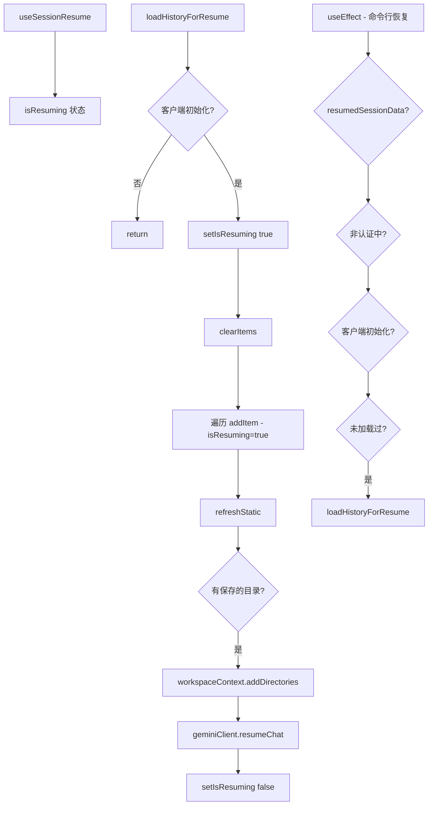

# useSessionResume.ts

> 处理会话恢复逻辑，支持交互式浏览器恢复和命令行参数恢复

## 概述

`useSessionResume` 是一个 React Hook，处理两种会话恢复场景：

1. **交互式恢复**：通过 `loadHistoryForResume` 函数，由会话浏览器触发。
2. **命令行恢复**：自动检测 `-r`/`--resume` 参数传入的 `resumedSessionData`，在客户端初始化后自动恢复。

恢复过程包括：清空现有历史、加载 UI 历史项、恢复工作区目录、将历史传递给 Gemini 客户端。

## 架构图（mermaid）

## 主要导出

| 导出名 | 类型 | 说明 |
|--------|------|------|
| `useSessionResume` | `(params) => { loadHistoryForResume, isResuming }` | 返回恢复函数和状态 |

## 核心逻辑

1. **loadHistoryForResume**：
   - 等待 `isGeminiClientInitialized` 为 true。
   - 清空现有历史，逐条添加 UI 历史项（`isResuming=true` 标记避免重复录制）。
   - 调用 `refreshStatic()` 强制重渲染 Static 组件。
   - 恢复会话中保存的工作区目录。
   - 调用 `geminiClient.resumeChat()` 恢复客户端状态。
2. **命令行自动恢复**：
   - `useEffect` 监听 `resumedSessionData`、`isAuthenticating`、`isGeminiClientInitialized`。
   - 使用 `hasLoadedResumedSession` ref 确保仅执行一次。
   - 所有条件满足时自动调用 `loadHistoryForResume`。
3. 使用 ref 避免 `historyManager` 和 `refreshStatic` 的循环依赖。

## 内部依赖

| 依赖 | 路径 | 说明 |
|------|------|------|
| `HistoryItemWithoutId` | `../types.js` | 历史项类型 |
| `UseHistoryManagerReturn` | `./useHistoryManager.js` | 历史管理器类型 |
| `convertSessionToHistoryFormats` | `./useSessionBrowser.js` | 会话转换工具 |

## 外部依赖

| 依赖 | 说明 |
|------|------|
| `react` | `useCallback`, `useEffect`, `useRef`, `useState` |
| `@google/gemini-cli-core` | `coreEvents`, `Config`, `ResumedSessionData`, `convertSessionToClientHistory` |
| `@google/genai` | `Part` 类型 |
