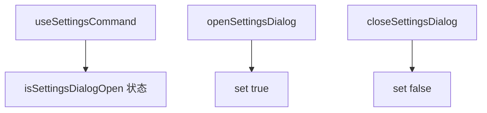

# useSettingsCommand.ts

> 管理设置对话框的打开/关闭状态

## 概述

`useSettingsCommand` 是一个简单的 React Hook，提供设置（Settings）对话框的状态管理。它仅维护一个布尔状态 `isSettingsDialogOpen`，以及两个用 `useCallback` 包装的稳定操作函数。

## 架构图（mermaid）

## 主要导出

| 导出名 | 类型 | 说明 |
|--------|------|------|
| `useSettingsCommand` | `() => { isSettingsDialogOpen, openSettingsDialog, closeSettingsDialog }` | 返回对话框状态和控制函数 |

## 核心逻辑

1. `useState(false)` 初始化对话框关闭状态。
2. `openSettingsDialog` 和 `closeSettingsDialog` 使用空依赖的 `useCallback` 保持引用稳定。

## 内部依赖

无。

## 外部依赖

| 依赖 | 说明 |
|------|------|
| `react` | `useState`, `useCallback` |
