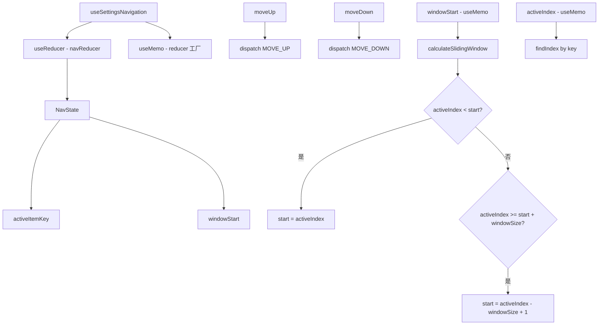

# useSettingsNavigation.ts

> 为设置页面提供带滑动窗口的键盘导航逻辑

## 概述

`useSettingsNavigation` 是一个 React Hook，为设置页面的列表导航提供带虚拟滚动窗口的键盘控制。当列表项超过可显示数量时，导航时窗口会自动滑动以保持活跃项可见。

支持首尾循环导航，并在 items 变化（如搜索过滤）时保持当前高亮项。

## 架构图（mermaid）

## 主要导出

| 导出名 | 类型 | 说明 |
|--------|------|------|
| `UseSettingsNavigationProps` | `interface` | `{ items, maxItemsToShow }` |
| `useSettingsNavigation` | `(props) => { activeItemKey, activeIndex, windowStart, moveUp, moveDown }` | 返回导航状态和操作 |

## 核心逻辑

1. **createNavReducer**：工厂函数，闭包捕获 `items` 和 `maxItemsToShow`，生成定制的 reducer。
2. **MOVE_UP/MOVE_DOWN**：更新 `activeItemKey` 并通过 `calculateSlidingWindow` 计算新的 `windowStart`。
3. **calculateSlidingWindow**：
   - 活跃项在窗口上方：窗口上移到活跃项。
   - 活跃项在窗口下方：窗口下移使活跃项在底部。
   - 边界约束：`Math.max(0, Math.min(start, itemCount - windowSize))`。
4. **activeIndex** 和 **windowStart** 通过 `useMemo` 重新计算，确保 items 变化后依然正确。
5. 使用 `key` 而非 `index` 标识活跃项，在搜索过滤后能保持高亮。

## 内部依赖

无。

## 外部依赖

| 依赖 | 说明 |
|------|------|
| `react` | `useMemo`, `useReducer`, `useCallback` |
