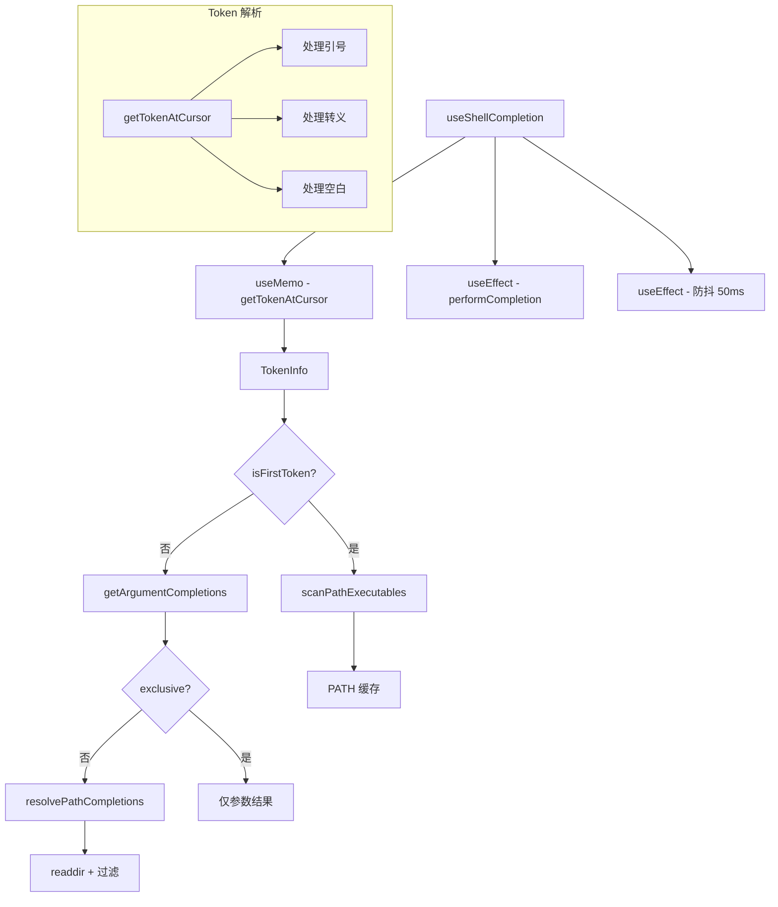

# useShellCompletion.ts

> 为嵌入式 Shell 提供命令和路径的 Tab 补全功能

## 概述

`useShellCompletion` 是一个大型 React Hook（650+ 行），为嵌入式 Shell 输入提供 Tab 补全功能。它包含两种补全模式：

1. **命令补全**：当光标在第一个 token 时，从 `$PATH` 中扫描可执行文件。
2. **参数补全**：当光标在后续 token 时，提供文件系统路径补全和命令特定的参数补全。

还包含多个导出的工具函数：Shell 路径转义、token 解析、PATH 扫描、路径补全。

## 架构图（mermaid）

## 主要导出

| 导出名 | 类型 | 说明 |
|--------|------|------|
| `escapeShellPath` | `(segment: string) => string` | Unix Shell 特殊字符转义 |
| `TokenInfo` | `interface` | Token 解析结果 |
| `getTokenAtCursor` | `(line: string, cursorCol: number) => TokenInfo \| null` | 解析光标处的 token |
| `scanPathExecutables` | `(signal?) => Promise<string[]>` | 扫描 PATH 中的可执行文件 |
| `resolvePathCompletions` | `(partial, cwd, signal?) => Promise<Suggestion[]>` | 文件系统路径补全 |
| `UseShellCompletionProps` | `interface` | Hook 参数 |
| `UseShellCompletionReturn` | `interface` | `{ completionStart, completionEnd, query, activeStart }` |
| `useShellCompletion` | `(props) => UseShellCompletionReturn` | 主 Hook |

## 核心逻辑

1. **getTokenAtCursor**：完整的 Shell token 解析器，处理反斜杠转义、单引号、双引号和空白分隔。
2. **scanPathExecutables**：并行扫描 `$PATH` 中所有目录，检查文件的可执行权限，结果排序去重。Windows 上额外添加内置命令和 PATHEXT 检查。
3. **resolvePathCompletions**：支持 `~` 展开、引号剥离、大小写不敏感匹配、dotfile 隐藏、目录优先排序。
4. **performCompletion**：
   - 命令位置：使用 PATH 缓存（`pathCachePromiseRef`），按长度排序。
   - 参数位置：先尝试 `getArgumentCompletions`（命令特定），再 fallback 到路径补全。
5. **防抖**：50ms 防抖避免快速输入时的频繁搜索。
6. **闪烁防护**：`activeStart` 状态检测 token 范围变化时立即清空旧建议。

## 内部依赖

| 依赖 | 路径 | 说明 |
|------|------|------|
| `Suggestion` | `../components/SuggestionsDisplay.js` | 建议类型 |
| `getArgumentCompletions` | `./shell-completions/index.js` | 命令特定参数补全 |

## 外部依赖

| 依赖 | 说明 |
|------|------|
| `react` | `useEffect`, `useRef`, `useCallback`, `useMemo`, `useState` |
| `node:fs/promises` | 目录读取、文件权限检查 |
| `node:path` | 路径操作 |
| `node:os` | `os.homedir()` |
| `@google/gemini-cli-core` | `debugLogger` |
