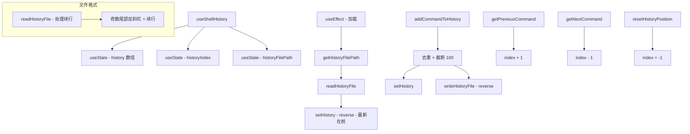

# useShellHistory.ts

> 管理嵌入式 Shell 的命令历史，支持文件持久化和上下翻阅

## 概述

`useShellHistory` 是一个 React Hook，为嵌入式 Shell 提供命令历史管理功能。它将历史记录持久化到磁盘文件，支持最多 100 条记录。

核心功能：
- 从磁盘加载历史记录。
- 添加新命令时自动去重和截断。
- 上/下翻阅历史命令。
- 支持多行命令的正确解析（反斜杠续行）。

## 架构图（mermaid）

## 主要导出

| 导出名 | 类型 | 说明 |
|--------|------|------|
| `UseShellHistoryReturn` | `interface` | `{ history, addCommandToHistory, getPreviousCommand, getNextCommand, resetHistoryPosition }` |
| `useShellHistory` | `(projectRoot: string, storage?) => UseShellHistoryReturn` | 返回历史数据和操作函数 |

## 核心逻辑

1. **readHistoryFile**：逐行读取，检测尾部反斜杠的奇偶数决定是否为续行，将多行命令合并为单条记录。
2. **addCommandToHistory**：将新命令插入数组头部，过滤掉重复项，截断到 100 条，异步写回磁盘（反转为最旧在前）。
3. **getPreviousCommand**：递增 `historyIndex`（最大为 `length - 1`），返回对应命令。
4. **getNextCommand**：递减 `historyIndex`（到 -1 时返回空字符串，表示回到当前输入）。
5. 历史文件路径通过 `Storage.getHistoryFilePath()` 获取。

## 内部依赖

无。

## 外部依赖

| 依赖 | 说明 |
|------|------|
| `react` | `useState`, `useEffect`, `useCallback` |
| `node:fs/promises` | 文件读写 |
| `node:path` | 路径操作 |
| `@google/gemini-cli-core` | `debugLogger`, `isNodeError`, `Storage` |
