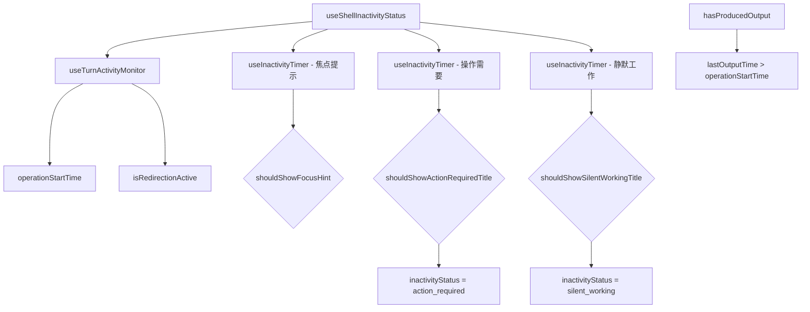

# useShellInactivityStatus.ts

> 综合判断 Shell 的不活跃状态，提供焦点提示和终端标题状态指示

## 概述

`useShellInactivityStatus` 是一个组合型 React Hook，集中管理所有与 Shell 不活跃相关的状态检测。它组合了 `useInactivityTimer` 和 `useTurnActivityMonitor`，输出两个关键信号：

1. **shouldShowFocusHint**：是否应显示"按 Tab 聚焦 Shell"的提示。
2. **inactivityStatus**：终端标题应显示的状态图标（none / action_required / silent_working）。

三种不活跃检测使用不同的延迟和条件：
- **焦点提示**：有输出时 5 秒，无输出时 20 秒。重定向时抑制。
- **操作需要**：仅在有输出时触发，30 秒后显示。重定向时抑制。
- **静默工作**：重定向或无输出时触发，重定向 2 分钟 / 无输出 60 秒。

## 架构图（mermaid）

## 主要导出

| 导出名 | 类型 | 说明 |
|--------|------|------|
| `InactivityStatus` | `type` | `'none' \| 'action_required' \| 'silent_working'` |
| `ShellInactivityStatus` | `interface` | `{ shouldShowFocusHint, inactivityStatus }` |
| `useShellInactivityStatus` | `(props) => ShellInactivityStatus` | 返回不活跃状态 |

## 核心逻辑

1. `isAwaitingFocus`：`activePtyId` 存在且未聚焦且交互式 Shell 已启用。
2. `hasProducedOutput`：比较 `lastOutputTime` 和 `operationStartTime`。
3. 三个 `useInactivityTimer` 使用不同的 `isActive` 条件和 `delayMs`：
   - 焦点提示：`isAwaitingFocus && !isRedirectionActive`，延迟根据是否有输出决定。
   - 操作需要：`isAwaitingFocus && !isRedirectionActive && hasProducedOutput`，30 秒。
   - 静默工作：`isAwaitingFocus && (isRedirectionActive || !hasProducedOutput)`，重定向 2 分钟 / 无输出 60 秒。
4. 优先级：`action_required` > `silent_working` > `none`。

## 内部依赖

| 依赖 | 路径 | 说明 |
|------|------|------|
| `useInactivityTimer` | `./useInactivityTimer.js` | 不活跃定时器 |
| `useTurnActivityMonitor` | `./useTurnActivityMonitor.js` | 回合活动监控 |
| `SHELL_FOCUS_HINT_DELAY_MS` 等 | `../constants.js` | 延迟常量 |
| `StreamingState` | `../types.js` | 流式状态类型 |
| `TrackedToolCall` | `./useToolScheduler.js` | 工具调用跟踪类型 |

## 外部依赖

无（仅依赖内部模块）。
