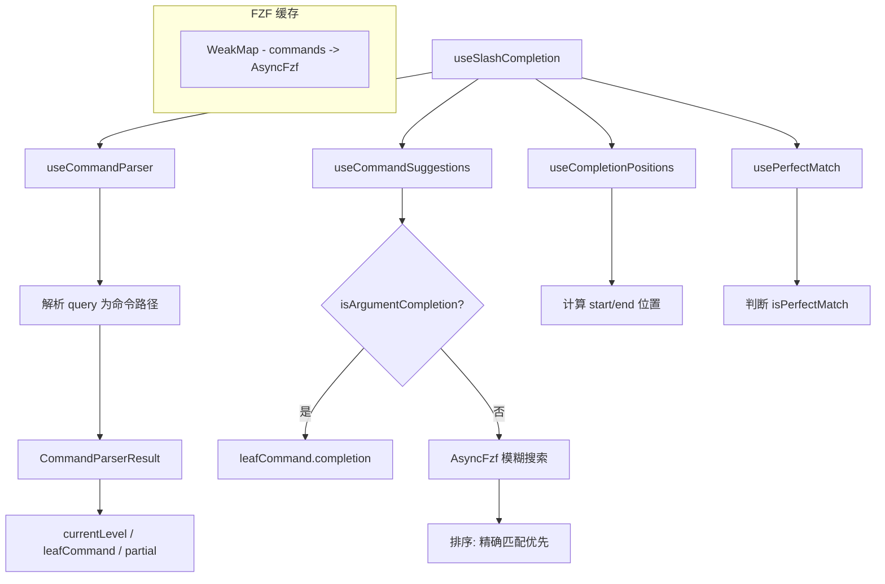

# useSlashCompletion.ts

> 提供 Slash 命令（/command）的层级化模糊补全和参数补全功能

## 概述

`useSlashCompletion` 是一个大型 React Hook（679 行），实现了 Slash 命令的完整补全逻辑。支持：

1. **层级命令解析**：如 `/extensions update` 的两级命令。
2. **模糊搜索**：使用 AsyncFzf 进行大小写不敏感的模糊匹配。
3. **参数补全**：命令确定后，调用命令的 `completion` 函数获取参数建议。
4. **精确匹配检测**：判断输入是否完全匹配某个命令。
5. **别名支持**：命令可通过 `altNames` 定义别名。
6. **前缀快捷下降**：`/cha` 可以直接显示 `/chat` 的子命令菜单。

内部拆分为 4 个独立的子 Hook：`useCommandParser`、`useCommandSuggestions`、`useCompletionPositions`、`usePerfectMatch`。

## 架构图（mermaid）

## 主要导出

| 导出名 | 类型 | 说明 |
|--------|------|------|
| `UseSlashCompletionProps` | `interface` | Hook 参数 |
| `useSlashCompletion` | `(props) => { completionStart, completionEnd, getCommandFromSuggestion, isArgumentCompletion, leafCommand }` | 返回补全位置和查询函数 |

## 核心逻辑

1. **useCommandParser**：
   - 将 `/extensions update foo` 解析为 `commandPathParts: ['extensions', 'update']`, `partial: 'foo'`。
   - 遍历命令层级树匹配 `commandPathParts`，确定 `currentLevel` 和 `leafCommand`。
   - 处理精确匹配父命令自动下降和前缀快捷下降（/chat、/resume）。
2. **useCommandSuggestions**：
   - 参数补全：调用 `leafCommand.completion(context, argString)`。
   - 命令补全：使用 `AsyncFzf` 模糊搜索，fallback 到前缀匹配。
   - 特殊处理 `/chat` 和 `/resume` 的自动保存会话列表。
3. **AsyncFzf 缓存**：使用 `WeakMap<readonly SlashCommand[], FzfCommandCacheEntry>` 自动管理缓存生命周期。
4. **useCompletionPositions**：计算建议应替换的文本范围。
5. **usePerfectMatch**：检测输入是否精确匹配某个可执行命令。

## 内部依赖

| 依赖 | 路径 | 说明 |
|------|------|------|
| `Suggestion` | `../components/SuggestionsDisplay.js` | 建议类型 |
| `CommandKind`, `CommandContext`, `SlashCommand` | `../commands/types.js` | 命令类型 |

## 外部依赖

| 依赖 | 说明 |
|------|------|
| `react` | `useState`, `useEffect`, `useMemo` |
| `fzf` | `AsyncFzf` 模糊搜索引擎 |
| `@google/gemini-cli-core` | `debugLogger` |
