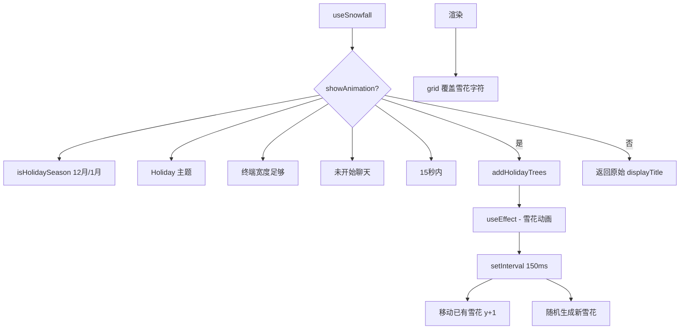

# useSnowfall.ts

> 在节日主题下为 ASCII Logo 添加雪花飘落动画和圣诞树装饰

## 概述

`useSnowfall` 是一个 React Hook，在特定条件下为 CLI 的 ASCII Art Logo 添加视觉效果：

1. **节日检测**：仅在 12 月和 1 月生效。
2. **主题检测**：仅在使用 Holiday 主题时生效。
3. **圣诞树**：在 Logo 下方添加三棵 ASCII 圣诞树。
4. **雪花动画**：以 150ms 帧率生成并移动雪花字符（`*`, `.`, `·`, `+`），15 秒后停止。
5. **交互触发停止**：用户开始聊天后停止动画。

雪花通过覆盖 ASCII Art 网格中的字符实现渲染。

## 架构图（mermaid）

## 主要导出

| 导出名 | 类型 | 说明 |
|--------|------|------|
| `useSnowfall` | `(displayTitle: string) => string` | 返回可能带动画的 ASCII Art 字符串 |

## 核心逻辑

1. **显示条件**：`isHolidaySeason && Holiday.name === currentTheme.name && terminalWidth >= widthOfShortLogo && !hasStartedChat && showSnow`。
2. **addHolidayTrees**：创建三棵并排的 ASCII 圣诞树，居中对齐在 Logo 下方。
3. **雪花生成**：30% 概率每帧生成 1-2 个雪花，随机 x 坐标和字符。
4. **雪花移动**：每帧所有雪花 y+1，超出高度的被过滤掉。
5. **渲染**：将 displayArt 转为二维字符数组，将雪花字符覆盖到对应位置，再拼接回字符串。
6. `showSnow` 在 `historyRemountKey` 变化时重置为 true，15 秒后自动 false。

## 内部依赖

| 依赖 | 路径 | 说明 |
|------|------|------|
| `getAsciiArtWidth` | `../utils/textUtils.js` | ASCII Art 宽度计算 |
| `debugState` | `../debug.js` | 动画计数调试 |
| `themeManager` | `../themes/theme-manager.js` | 主题管理器 |
| `Holiday` | `../themes/builtin/dark/holiday-dark.js` | 节日主题 |
| `useUIState` | `../contexts/UIStateContext.js` | UI 状态 |
| `useTerminalSize` | `./useTerminalSize.js` | 终端尺寸 |
| `shortAsciiLogo` | `../components/AsciiArt.js` | 短版 Logo |

## 外部依赖

| 依赖 | 说明 |
|------|------|
| `react` | `useState`, `useEffect`, `useMemo` |
