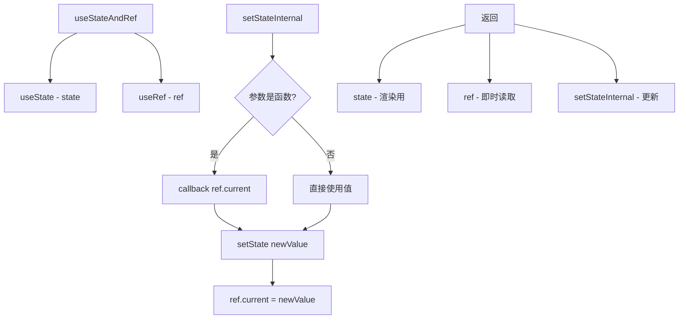

# useStateAndRef.ts

> 返回 state、ref 和 setter 三元组，解决同一函数内多次读取最新状态的问题

## 概述

`useStateAndRef` 是一个通用的 React Hook，组合了 `useState` 和 `useRef`。它解决了 React 中一个常见问题：在同一个事件处理函数中，通过 `setState` 更新状态后，后续读取的仍是旧值（因为 state 在下次渲染才更新）。

通过同时维护 `state` 和 `ref.current`，更新时两者同步写入，读取时通过 `ref.current` 获取最新值。

## 架构图（mermaid）

## 主要导出

| 导出名 | 类型 | 说明 |
|--------|------|------|
| `useStateAndRef` | `<T>(initialValue: T) => readonly [T, React.MutableRefObject<T>, React.Dispatch<React.SetStateAction<T>>]` | 返回 [state, ref, setter] |

## 核心逻辑

1. `state` 用于触发 React 重渲染。
2. `ref.current` 始终持有最新值，可在任何地方同步读取。
3. `setStateInternal` 封装了 `setState`，同时更新 `ref.current`。
4. 支持函数式更新：`setStateInternal(prev => prev + 1)` 使用 `ref.current` 作为 prev。
5. 类型约束排除了函数类型（`T extends object | null | undefined | number | string | boolean`），避免与函数式更新的歧义。

## 内部依赖

无。

## 外部依赖

| 依赖 | 说明 |
|------|------|
| `react` | `useState`, `useRef`, `useCallback` |
