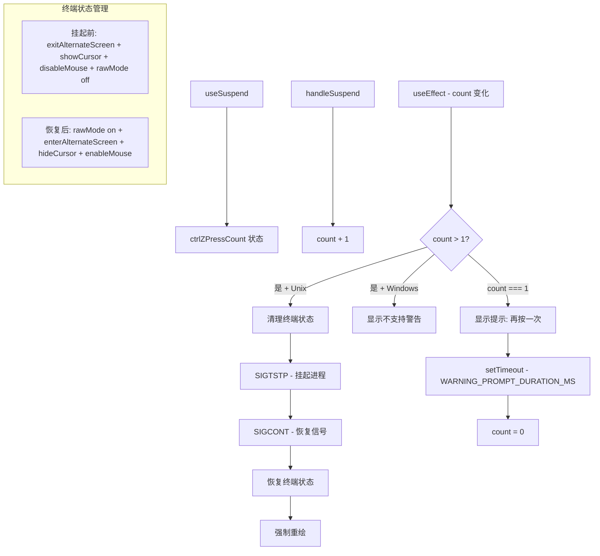

# useSuspend.ts

> 实现 Ctrl+Z 双击挂起应用到后台，处理终端状态保存/恢复

## 概述

`useSuspend` 是一个 React Hook，实现了 Unix Shell 风格的应用挂起功能。用户需要连按两次 Ctrl+Z 才能挂起（第一次显示提示），这是为了避免与撤销快捷键冲突。

挂起和恢复过程需要精确地管理终端状态：
- **挂起前**：退出备用缓冲区、显示光标、禁用鼠标事件、退出 raw mode。
- **恢复后**：重新进入 raw mode 和备用缓冲区、隐藏光标、启用鼠标事件、强制完全重绘。

不支持 Windows 平台。

## 架构图（mermaid）

## 主要导出

| 导出名 | 类型 | 说明 |
|--------|------|------|
| `useSuspend` | `(props: UseSuspendProps) => { handleSuspend: () => void }` | 返回挂起触发函数 |

## 核心逻辑

1. **第一次按键**（count === 1）：通过 `handleWarning` 显示提示消息，启动 `WARNING_PROMPT_DURATION_MS` 超时后重置计数。
2. **第二次按键**（count > 1）：
   - 检查平台（Windows 不支持）。
   - 退出备用缓冲区（如果启用），启用行包装，清屏。
   - 显示光标、禁用鼠标事件、清理终端状态。
   - 关闭 raw mode。
   - 注册 `process.once('SIGCONT', onResume)` 监听恢复信号。
   - 调用 `process.kill(0, 'SIGTSTP')` 挂起整个进程组。
3. **恢复**（`onResume`）：
   - 恢复 raw mode、备用缓冲区、终端能力。
   - 隐藏光标、启用鼠标事件。
   - 触发 resize 事件和组件重新挂载。
4. 组件卸载时清理定时器和 SIGCONT 监听器。

## 内部依赖

| 依赖 | 路径 | 说明 |
|------|------|------|
| `cleanupTerminalOnExit`, `terminalCapabilityManager` | `../utils/terminalCapabilityManager.js` | 终端能力管理 |
| `WARNING_PROMPT_DURATION_MS` | `../constants.js` | 提示时长 |
| `formatCommand` | `../key/keybindingUtils.js` | 快捷键格式化 |
| `Command` | `../key/keyBindings.js` | 命令枚举 |

## 外部依赖

| 依赖 | 说明 |
|------|------|
| `react` | `useState`, `useRef`, `useEffect`, `useCallback` |
| `node:process` | 信号处理、raw mode |
| `@google/gemini-cli-core` | `writeToStdout`, `disableMouseEvents`, `enableMouseEvents`, `enterAlternateScreen`, `exitAlternateScreen`, `enableLineWrapping`, `disableLineWrapping` |
