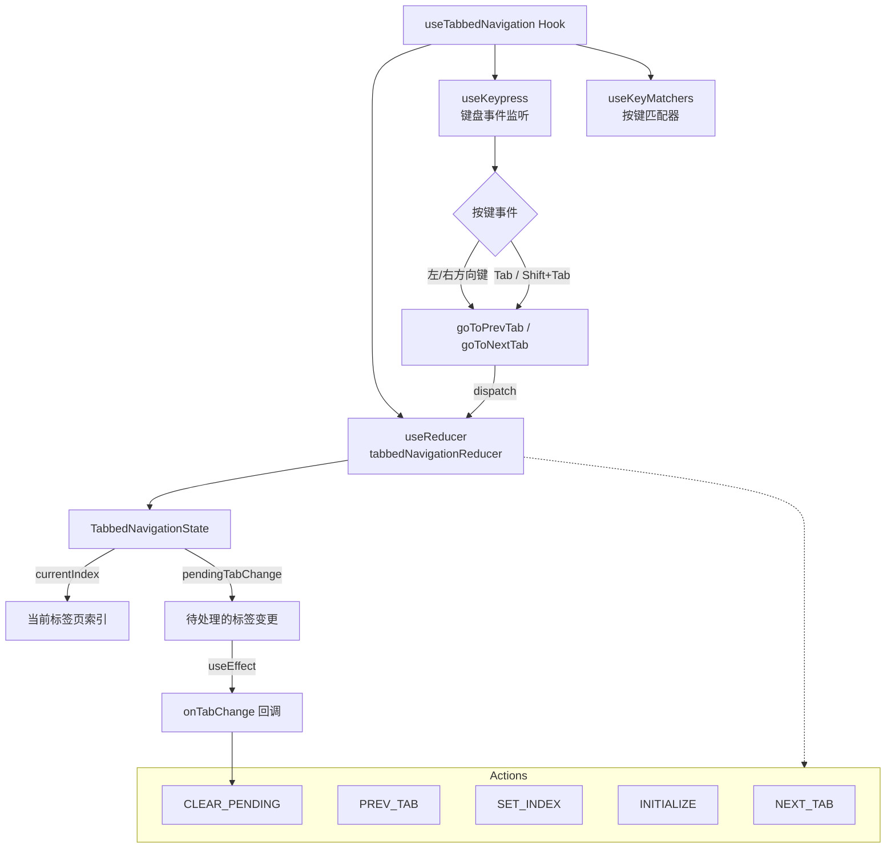

# useTabbedNavigation.ts

> 提供键盘驱动的标签页导航能力的无头（headless）React Hook，支持方向键、Tab 键切换及环绕导航。

## 概述

`useTabbedNavigation` 是一个无头 Hook，为标签页式界面提供完整的键盘导航支持。它通过 `useReducer` 配合自定义 reducer（`tabbedNavigationReducer`）管理当前激活的标签页索引，并响应左右方向键、Tab/Shift+Tab 键等键盘事件来切换标签页。支持环绕导航（wrap-around）、导航阻塞检测（如文本输入场景中禁用导航）、配置参数变更时的状态同步、以及标签页变化回调通知等特性。

## 架构图

## 主要导出

| 导出名称 | 类型 | 说明 |
|---|---|---|
| `UseTabbedNavigationOptions` | `interface` | Hook 的配置选项，包括 tabCount、initialIndex、wrapAround、enableArrowNavigation、enableTabKey、isNavigationBlocked、isActive、onTabChange |
| `UseTabbedNavigationResult` | `interface` | Hook 返回值类型，包括 currentIndex、setCurrentIndex、goToNextTab、goToPrevTab、isFirstTab、isLastTab |
| `useTabbedNavigation` | `function` | 主 Hook 函数，接收 `UseTabbedNavigationOptions`，返回 `UseTabbedNavigationResult` |

### UseTabbedNavigationOptions 字段

| 字段 | 类型 | 默认值 | 说明 |
|---|---|---|---|
| `tabCount` | `number` | - | 标签页总数 |
| `initialIndex` | `number` | `0` | 初始激活标签索引 |
| `wrapAround` | `boolean` | `false` | 是否启用首尾环绕导航 |
| `enableArrowNavigation` | `boolean` | `true` | 是否启用方向键导航 |
| `enableTabKey` | `boolean` | `true` | 是否启用 Tab 键导航 |
| `isNavigationBlocked` | `() => boolean` | - | 导航阻塞判断回调 |
| `isActive` | `boolean` | `true` | Hook 是否响应键盘输入 |
| `onTabChange` | `(index: number) => void` | - | 标签页切换时的回调 |

### UseTabbedNavigationResult 字段

| 字段 | 类型 | 说明 |
|---|---|---|
| `currentIndex` | `number` | 当前标签页索引 |
| `setCurrentIndex` | `(index: number) => void` | 直接设置标签页索引 |
| `goToNextTab` | `() => void` | 切换到下一个标签页 |
| `goToPrevTab` | `() => void` | 切换到上一个标签页 |
| `isFirstTab` | `boolean` | 是否为第一个标签页 |
| `isLastTab` | `boolean` | 是否为最后一个标签页 |

## 核心逻辑

1. **状态管理（Reducer 模式）**：使用 `useReducer` 配合 `tabbedNavigationReducer` 管理 `TabbedNavigationState`，支持五种 Action 类型：`NEXT_TAB`、`PREV_TAB`、`SET_INDEX`、`INITIALIZE`、`CLEAR_PENDING`。

2. **边界与环绕处理**：`NEXT_TAB` 和 `PREV_TAB` 在越界时根据 `wrapAround` 配置决定是循环回到起点/终点，还是保持在边界不动。若索引未发生变化则不产生新状态。

3. **参数变更同步**：通过 `useRef` 跟踪上一次的 `tabCount`、`initialIndex`、`wrapAround`，当这些外部参数变化时触发 `INITIALIZE` Action 重新初始化状态，确保 Reducer 内部状态与外部配置一致。

4. **键盘事件处理**：通过 `useKeypress` 注册按键监听，结合 `useKeyMatchers` 匹配 `MOVE_LEFT`、`MOVE_RIGHT`（方向键）和 `DIALOG_NEXT`、`DIALOG_PREV`（Tab 键）命令。仅在 `isActive` 为 `true` 且 `tabCount > 1` 时激活监听。

5. **导航阻塞**：在执行任何导航操作前，均检查 `isNavigationBlocked?.()` 回调，若返回 `true` 则跳过导航，适用于文本输入等需要屏蔽导航的场景。

6. **标签变更通知**：利用 `pendingTabChange` 标志位和 `useEffect`，在标签页切换后触发 `onTabChange` 回调，然后 dispatch `CLEAR_PENDING` 清除标志位，避免重复通知。

## 内部依赖

| 模块 | 说明 |
|---|---|
| `./useKeypress.js` | 提供 `useKeypress` Hook 和 `Key` 类型，用于监听键盘输入 |
| `../key/keyMatchers.js` | 提供 `Command` 枚举，定义键盘命令映射（如 MOVE_LEFT、MOVE_RIGHT） |
| `./useKeyMatchers.js` | 提供 `useKeyMatchers` Hook，返回按键匹配函数映射 |

## 外部依赖

| 模块 | 说明 |
|---|---|
| `react` | 使用 `useReducer`、`useCallback`、`useEffect`、`useRef` |
