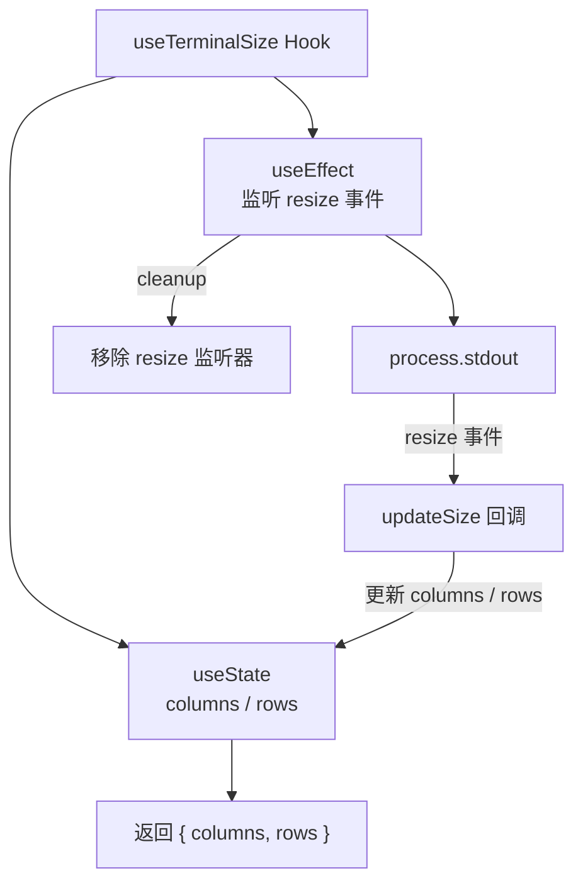

# useTerminalSize.ts

> 实时监听并返回终端窗口尺寸（列数和行数）的 React Hook。

## 概述

`useTerminalSize` 通过监听 `process.stdout` 的 `resize` 事件来追踪终端窗口大小的变化。它在初始化时读取当前终端的列数（columns）和行数（rows），若无法获取则使用默认值（60 列、20 行），并在窗口大小发生变化时自动更新状态。该 Hook 适用于需要根据终端尺寸进行自适应布局的 CLI 界面组件。

## 架构图

## 主要导出

| 导出名称 | 类型 | 说明 |
|---|---|---|
| `useTerminalSize` | `function` | 主 Hook 函数，无参数，返回 `{ columns: number; rows: number }` |

## 核心逻辑

1. **初始化**：通过 `useState` 读取 `process.stdout.columns` 和 `process.stdout.rows` 作为初始值，若不可用则分别使用默认值 60 和 20。

2. **事件监听**：在 `useEffect` 中定义 `updateSize` 函数并注册为 `process.stdout` 的 `resize` 事件监听器。当终端窗口大小变化时，`updateSize` 会重新读取 `process.stdout.columns` 和 `process.stdout.rows` 并更新状态。

3. **清理**：在 `useEffect` 的清理函数中通过 `process.stdout.off('resize', updateSize)` 移除事件监听器，防止内存泄漏。

4. **空依赖数组**：`useEffect` 使用空依赖数组 `[]`，确保只在挂载和卸载时注册/移除监听器。

## 内部依赖

无。

## 外部依赖

| 模块 | 说明 |
|---|---|
| `react` | 使用 `useEffect`、`useState` |
| `process.stdout`（Node.js 内置） | 用于获取终端列数/行数以及监听 `resize` 事件 |
