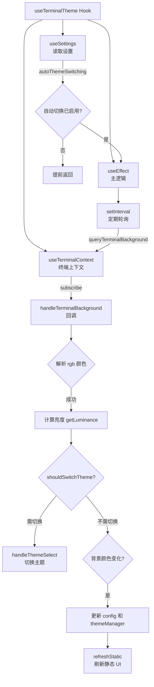

# useTerminalTheme.ts

> 自动检测终端背景颜色变化并动态切换明暗主题的 React Hook。

## 概述

`useTerminalTheme` 实现了终端背景颜色的轮询检测和自动主题切换功能。它定期通过终端上下文查询背景颜色，解析 `rgb:rrrr/gggg/bbbb` 格式的颜色响应，计算亮度（luminance）判断当前背景是明色还是暗色，进而自动在默认暗色主题（`DEFAULT_THEME`）和默认亮色主题（`DefaultLight`）之间切换。该 Hook 尊重用户的 `autoThemeSwitching` 配置，仅在使用默认主题时执行自动切换，并在检测到背景颜色变化时同步更新全局配置和主题管理器。

## 架构图

## 主要导出

| 导出名称 | 类型 | 说明 |
|---|---|---|
| `useTerminalTheme` | `function` | 主 Hook 函数，接收 `handleThemeSelect`、`config`、`refreshStatic` 三个参数，无返回值（副作用 Hook） |

### 参数

| 参数 | 类型 | 说明 |
|---|---|---|
| `handleThemeSelect` | `UIActions['handleThemeSelect']` | 主题选择处理函数，来自 UIActionsContext |
| `config` | `Config` | 应用配置对象，用于读写终端背景颜色 |
| `refreshStatic` | `() => void` | 刷新静态 UI 的回调，在背景颜色变化但主题未切换时调用 |

## 核心逻辑

1. **前置条件检查**：若 `autoThemeSwitching` 设置为 `false`，或启动时未检测到终端背景颜色（`config.getTerminalBackground() === undefined`），则直接返回不执行任何操作。

2. **定时轮询**：使用 `setInterval` 按照 `settings.merged.ui.terminalBackgroundPollingInterval`（单位：秒）配置的间隔定期调用 `queryTerminalBackground()` 查询终端背景。仅当当前使用的是默认主题（通过 `themeManager.isDefaultTheme` 判断）时才执行查询。

3. **颜色解析**：通过正则表达式 `/^rgb:([0-9a-fA-F]{1,4})\/([0-9a-fA-F]{1,4})\/([0-9a-fA-F]{1,4})$/` 解析终端返回的颜色字符串，使用 `parseColor` 将 RGB 分量转换为十六进制颜色值。

4. **主题切换判断**：利用 `getLuminance` 计算背景亮度，再通过 `shouldSwitchTheme` 判断是否需要在暗色主题和亮色主题之间切换。

5. **状态同步**：当背景颜色发生变化时，调用 `config.setTerminalBackground` 和 `themeManager.setTerminalBackground` 同步更新；若主题未切换但背景变化，则调用 `refreshStatic()` 刷新已渲染的静态 UI（因为某些 UI 元素可能依赖旧的背景颜色）。

6. **事件订阅与清理**：通过 `subscribe` 注册 `handleTerminalBackground` 回调处理终端背景响应；在 `useEffect` 清理函数中清除轮询定时器（`clearInterval`）并取消事件订阅（`unsubscribe`）。

## 内部依赖

| 模块 | 说明 |
|---|---|
| `../themes/color-utils.js` | 提供 `getLuminance`、`parseColor`、`shouldSwitchTheme` 颜色工具函数 |
| `../themes/theme-manager.js` | 提供 `themeManager` 实例和 `DEFAULT_THEME` 默认暗色主题 |
| `../themes/builtin/light/default-light.js` | 提供 `DefaultLight` 亮色主题定义 |
| `../contexts/SettingsContext.js` | 提供 `useSettings` Hook，读取合并后的用户设置 |
| `../contexts/TerminalContext.js` | 提供 `useTerminalContext` Hook，包含 `subscribe`、`unsubscribe`、`queryTerminalBackground` |
| `../../config/settings.js` | 提供 `SettingScope` 枚举 |
| `../contexts/UIActionsContext.js` | 提供 `UIActions` 类型定义 |

## 外部依赖

| 模块 | 说明 |
|---|---|
| `react` | 使用 `useEffect` |
| `@google/gemini-cli-core` | 提供 `Config` 类型 |
