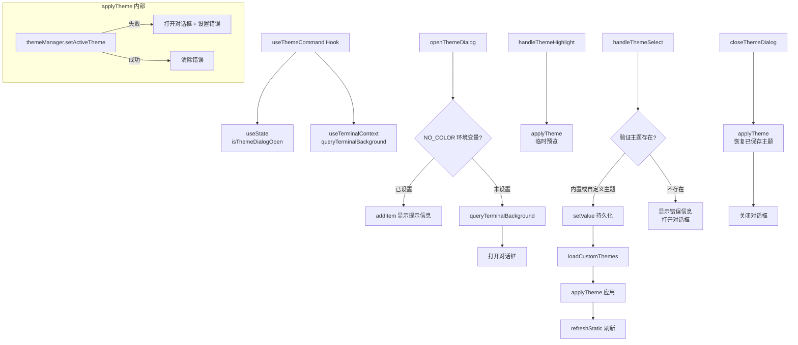

# useThemeCommand.ts

> 管理主题选择对话框的打开/关闭、主题预览、主题应用及持久化的 React Hook。

## 概述

`useThemeCommand` 封装了主题命令的完整交互逻辑，包括：打开/关闭主题选择对话框、预览高亮主题（hover 时临时切换）、确认选择并持久化主题设置。它处理了 `NO_COLOR` 环境变量的特殊情况（禁用主题配置）、自定义主题与内置主题的验证逻辑、以及对话框关闭时自动恢复原主题等边界场景。

## 架构图

## 主要导出

| 导出名称 | 类型 | 说明 |
|---|---|---|
| `useThemeCommand` | `function` | 主 Hook 函数，返回 `UseThemeCommandReturn` |

### 参数

| 参数 | 类型 | 说明 |
|---|---|---|
| `loadedSettings` | `LoadedSettings` | 已加载的设置对象，提供 user/workspace 两级设置 |
| `setThemeError` | `(error: string \| null) => void` | 设置主题错误信息的回调 |
| `addItem` | `UseHistoryManagerReturn['addItem']` | 向历史记录添加消息条目的函数 |
| `initialThemeError` | `string \| null` | 初始主题错误信息，非空时自动打开对话框 |
| `refreshStatic` | `() => void` | 刷新静态 UI 的回调 |

### UseThemeCommandReturn 接口

| 字段 | 类型 | 说明 |
|---|---|---|
| `isThemeDialogOpen` | `boolean` | 主题选择对话框是否打开 |
| `openThemeDialog` | `() => void` | 打开主题对话框（异步，会先查询终端背景） |
| `closeThemeDialog` | `() => void` | 关闭对话框并恢复为已保存的主题 |
| `handleThemeSelect` | `(themeName: string, scope: LoadableSettingScope) => Promise<void>` | 确认选择主题，验证、应用并持久化 |
| `handleThemeHighlight` | `(themeName: string \| undefined) => void` | 预览/高亮指定主题（不持久化） |

## 核心逻辑

1. **打开对话框**：`openThemeDialog` 先检查 `process.env['NO_COLOR']` 环境变量，若已设置则通过 `addItem` 添加 INFO 类型的提示消息并返回；否则先调用 `queryTerminalBackground()` 确保终端背景信息最新，然后设置 `isThemeDialogOpen` 为 `true`。

2. **主题应用（内部）**：`applyTheme` 调用 `themeManager.setActiveTheme(themeName)`，若主题不存在（返回 `false`）则打开对话框并通过 `setThemeError` 设置错误提示，成功则清除错误。

3. **主题预览**：`handleThemeHighlight` 直接调用 `applyTheme` 临时切换主题，不做持久化。当对话框关闭时会通过 `closeThemeDialog` 恢复原主题。

4. **主题选择确认**：`handleThemeSelect` 先合并 user 和 workspace 范围的 `customThemes`，验证所选主题是否为内置主题（`themeManager.findThemeByName`）或自定义主题，验证通过后调用 `loadedSettings.setValue` 持久化设置，加载自定义主题，应用主题并刷新静态 UI。无论成功与否，最终都关闭对话框（`finally` 块）。

5. **关闭对话框**：`closeThemeDialog` 将主题恢复为 `loadedSettings.merged.ui.theme`（已保存的值），撤销任何预览状态的变更，然后关闭对话框。

## 内部依赖

| 模块 | 说明 |
|---|---|
| `../themes/theme-manager.js` | 提供 `themeManager` 用于主题切换、查找和自定义主题加载 |
| `../../config/settings.js` | 提供 `LoadableSettingScope` 和 `LoadedSettings` 类型 |
| `../types.js` | 提供 `MessageType` 消息类型枚举 |
| `./useHistoryManager.js` | 提供 `UseHistoryManagerReturn` 类型 |
| `../contexts/TerminalContext.js` | 提供 `useTerminalContext` Hook，获取 `queryTerminalBackground` |

## 外部依赖

| 模块 | 说明 |
|---|---|
| `react` | 使用 `useState`、`useCallback` |
| `node:process` | 用于检查 `NO_COLOR` 环境变量 |
