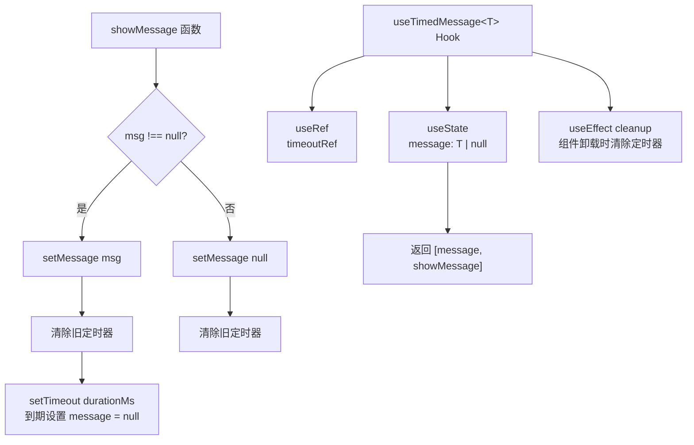

# useTimedMessage.ts

> 管理带自动消失功能的临时消息状态的泛型 React Hook。

## 概述

`useTimedMessage` 是一个泛型 Hook，用于管理在指定时间后自动清除的临时消息。调用 `showMessage` 设置消息后，经过 `durationMs` 毫秒消息会自动重置为 `null`。适用于瞬态 UI 提示、警告、操作反馈等需要自动消失的场景。支持在计时期间重新设置消息（会重置计时器），以及手动传入 `null` 立即清除消息且不启动新计时器。

## 架构图

## 主要导出

| 导出名称 | 类型 | 说明 |
|---|---|---|
| `useTimedMessage<T>` | `function` | 泛型 Hook，接收 `durationMs: number`，返回 `readonly [T \| null, (msg: T \| null) => void]` 元组 |

### 参数

| 参数 | 类型 | 说明 |
|---|---|---|
| `durationMs` | `number` | 消息自动消失的延迟时间（毫秒） |

### 返回值

| 索引 | 类型 | 说明 |
|---|---|---|
| 0 | `T \| null` | 当前消息值，无消息时为 `null` |
| 1 | `(msg: T \| null) => void` | 设置消息的函数，传入 `null` 可立即清除 |

## 核心逻辑

1. **消息状态**：使用 `useState<T | null>(null)` 维护当前消息，初始为 `null`。

2. **定时器管理**：使用 `useRef` 持有 `setTimeout` 的引用。每次调用 `showMessage` 时先调用 `setMessage` 更新消息，然后清除已有定时器（`clearTimeout`）。若消息非 `null`，则创建新的 `setTimeout`，在 `durationMs` 毫秒后将消息重置为 `null`。

3. **立即清除**：当传入 `null` 时，消息被立即清除且不会创建新的定时器（仅清除旧定时器）。

4. **清理**：`useEffect` 返回清理函数，在组件卸载时清除残留的定时器，防止内存泄漏和对已卸载组件的状态更新。

5. **返回值**：以 `as const` 元组形式返回 `[message, showMessage]`，保持类型推断的精确性（只读元组而非数组）。

## 内部依赖

无。

## 外部依赖

| 模块 | 说明 |
|---|---|
| `react` | 使用 `useState`、`useCallback`、`useRef`、`useEffect` |
