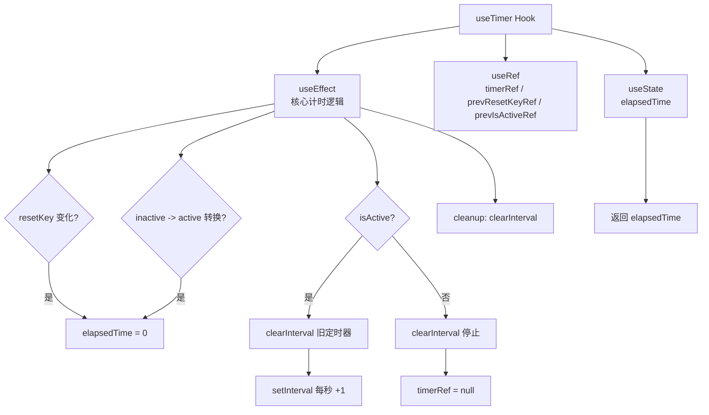

# useTimer.ts

> 提供可控的每秒递增计时器功能的 React Hook，支持启停和重置。

## 概述

`useTimer` 管理一个每秒递增的计时器，支持通过 `isActive` 参数控制启停，以及通过 `resetKey` 参数触发重置归零。当计时器从非激活状态切换为激活状态、或 `resetKey` 发生变化时，计时器会自动归零并重新开始计时。该 Hook 适用于显示操作耗时、等待时间等需要实时计时的 UI 场景。

## 架构图

## 主要导出

| 导出名称 | 类型 | 说明 |
|---|---|---|
| `useTimer` | `function` | 主 Hook 函数，接收 `isActive: boolean` 和 `resetKey: unknown`，返回 `number`（已流逝秒数） |

### 参数

| 参数 | 类型 | 说明 |
|---|---|---|
| `isActive` | `boolean` | 计时器是否处于运行状态 |
| `resetKey` | `unknown` | 重置键，值变化时计时器归零并重启 |

### 返回值

| 类型 | 说明 |
|---|---|
| `number` | 已流逝的秒数，从 0 开始递增 |

## 核心逻辑

1. **状态初始化**：`elapsedTime` 初始为 0，使用 `useRef` 分别保存定时器引用（`timerRef`）、上一次的 `resetKey`（`prevResetKeyRef`）和 `isActive`（`prevIsActiveRef`）。

2. **重置逻辑**：在 `useEffect` 中判断两种重置条件：
   - `resetKey` 与上次不同时，设置 `shouldResetTime = true`。
   - `isActive` 从 `false` 变为 `true` 时（inactive -> active 转换），设置 `shouldResetTime = true`。
   满足任一条件则将 `elapsedTime` 归零。

3. **定时器管理**：
   - 激活状态下，先无条件清除旧的 `setInterval`（确保 `resetKey` 变化时也能刷新定时器），然后创建新的每秒递增定时器（`setInterval(() => setElapsedTime(prev => prev + 1), 1000)`）。
   - 非激活状态下，清除定时器并将 `timerRef` 置为 `null`。

4. **清理**：`useEffect` 的清理函数中清除定时器，防止组件卸载或依赖变化时产生内存泄漏。

5. **依赖追踪**：`useEffect` 依赖 `[isActive, resetKey]`，当这两个值变化时重新执行整个计时器管理逻辑。

## 内部依赖

无。

## 外部依赖

| 模块 | 说明 |
|---|---|
| `react` | 使用 `useState`、`useEffect`、`useRef` |
