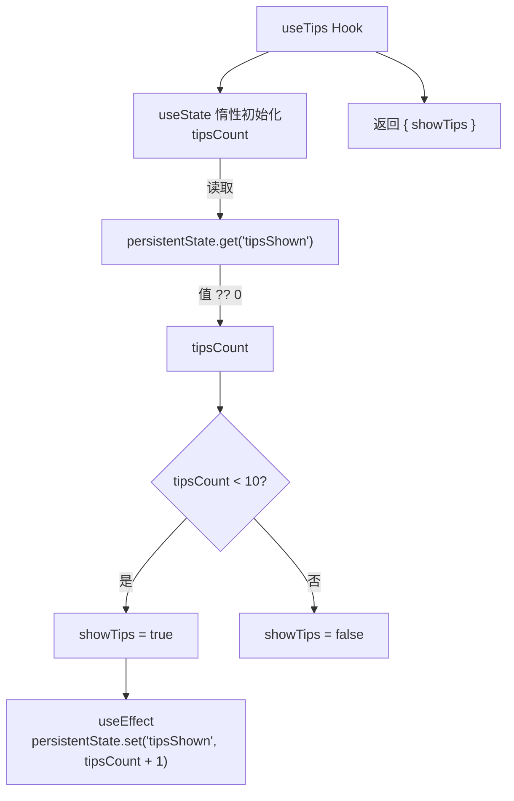

# useTips.ts

> 基于持久化计数器控制使用提示（tips）显示与否的 React Hook。

## 概述

`useTips` 通过读取持久化状态中的 `tipsShown` 计数值来决定是否向用户展示提示信息。当提示展示次数少于 10 次时，`showTips` 返回 `true` 并自动递增计数器；达到 10 次后不再显示提示。这是一种简单的"新手引导渐退"机制，让用户在最初几次使用时获得操作提示，之后自动隐藏以减少干扰。

## 架构图

## 主要导出

| 导出名称 | 类型 | 说明 |
|---|---|---|
| `useTips` | `function` | 主 Hook 函数，无参数，返回 `UseTipsResult` |

### UseTipsResult 接口

| 字段 | 类型 | 说明 |
|---|---|---|
| `showTips` | `boolean` | 是否应该显示使用提示 |

## 核心逻辑

1. **计数读取**：通过 `useState` 的惰性初始化函数从 `persistentState.get('tipsShown')` 读取已展示次数，使用空值合并运算符（`??`）在值为 `null`/`undefined` 时默认为 0。

2. **显示判断**：若 `tipsCount < 10` 则 `showTips` 为 `true`，否则为 `false`。阈值硬编码为 10 次。

3. **计数递增**：在 `useEffect` 中，当 `showTips` 为 `true` 时，将 `tipsCount + 1` 写入 `persistentState`，实现展示计数的自增。依赖数组为 `[tipsCount, showTips]`。

4. **单次写入**：由于 `tipsCount` 通过惰性初始化读取且不会在组件生命周期内改变（只有一个 `useState` 初始化），`useEffect` 在组件挂载时执行一次写入操作。

## 内部依赖

| 模块 | 说明 |
|---|---|
| `../../utils/persistentState.js` | 提供 `persistentState` 对象，用于跨会话持久化存储键值对（读取和写入 `tipsShown`） |

## 外部依赖

| 模块 | 说明 |
|---|---|
| `react` | 使用 `useEffect`、`useState` |
