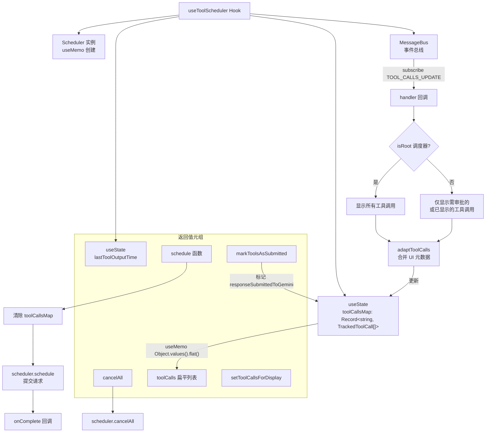

# useToolScheduler.ts

> 基于事件驱动的核心调度器（Core Scheduler）管理工具调用完整生命周期的 React Hook。

## 概述

`useToolScheduler` 是工具调用系统的核心 Hook，负责与 `@google/gemini-cli-core` 中的 `Scheduler` 进行交互。它管理工具调用的完整生命周期（调度 -> 验证 -> 等待审批 -> 执行 -> 完成/错误/取消），通过 `MessageBus` 订阅工具调用状态更新事件，维护一个按调度器 ID 分组的工具调用映射（`toolCallsMap`），并向上层组件提供扁平化的工具调用列表。该 Hook 还支持多调度器（子代理）场景下的工具调用过滤，避免只读工具（如搜索、文件读取）的不必要 UI 闪烁。

## 架构图

## 主要导出

| 导出名称 | 类型 | 说明 |
|---|---|---|
| `ScheduleFn` | `type` | 调度函数类型：`(request: ToolCallRequestInfo \| ToolCallRequestInfo[], signal: AbortSignal) => Promise<CompletedToolCall[]>` |
| `MarkToolsAsSubmittedFn` | `type` | 标记工具调用已提交的函数类型：`(callIds: string[]) => void` |
| `CancelAllFn` | `type` | 取消所有工具调用的函数类型：`(signal: AbortSignal) => void` |
| `TrackedToolCall` | `type` | 扩展了 `ToolCall`，增加 `responseSubmittedToGemini?: boolean` UI 标志 |
| `TrackedScheduledToolCall` | `type` | 状态为 `scheduled` 的 `TrackedToolCall` 窄化类型 |
| `TrackedValidatingToolCall` | `type` | 状态为 `validating` 的 `TrackedToolCall` 窄化类型 |
| `TrackedWaitingToolCall` | `type` | 状态为 `awaiting_approval` 的 `TrackedToolCall` 窄化类型 |
| `TrackedExecutingToolCall` | `type` | 状态为 `executing` 的 `TrackedToolCall` 窄化类型 |
| `TrackedCompletedToolCall` | `type` | 状态为 `success \| error` 的 `TrackedToolCall` 窄化类型 |
| `TrackedCancelledToolCall` | `type` | 状态为 `cancelled` 的 `TrackedToolCall` 窄化类型 |
| `useToolScheduler` | `function` | 主 Hook 函数，返回包含 6 个元素的元组 |

### 参数

| 参数 | 类型 | 说明 |
|---|---|---|
| `onComplete` | `(tools: CompletedToolCall[]) => Promise<void>` | 工具调用完成后的回调，将结果回注到 Gemini 流处理循环 |
| `config` | `Config` | 应用配置对象，用于获取 MessageBus 和创建 Scheduler |
| `getPreferredEditor` | `() => EditorType \| undefined` | 获取用户首选编辑器类型的函数 |

### 返回值元组

| 索引 | 类型 | 说明 |
|---|---|---|
| 0 | `TrackedToolCall[]` | 当前所有工具调用的扁平列表 |
| 1 | `ScheduleFn` | 调度工具调用的函数 |
| 2 | `MarkToolsAsSubmittedFn` | 标记指定工具调用已提交给 Gemini |
| 3 | `React.Dispatch<React.SetStateAction<TrackedToolCall[]>>` | 直接设置显示用工具调用列表的兼容性 setter |
| 4 | `CancelAllFn` | 取消所有进行中工具调用的函数 |
| 5 | `number` | 最后一次工具输出的时间戳（`lastToolOutputTime`） |

## 核心逻辑

1. **Scheduler 初始化**：通过 `useMemo` 创建 `Scheduler` 实例，绑定 `config`、`messageBus` 和 `getPreferredEditor`（通过 `useRef` 保持最新引用），使用 `ROOT_SCHEDULER_ID` 作为根调度器标识。组件卸载时调用 `scheduler.dispose()` 清理资源。

2. **事件订阅**：订阅 `MessageBus` 的 `TOOL_CALLS_UPDATE` 事件。对于根调度器（`ROOT_SCHEDULER_ID`），显示所有工具调用；对于子调度器（子代理），仅显示处于 `AwaitingApproval` 状态或先前已显示（`prevCallIds` 中存在）的工具调用，避免只读工具的 UI 闪烁。若子调度器无工具可显示且之前也未显示任何工具，则跳过更新以减少不必要的重渲染。

3. **适配层（adaptToolCalls）**：内部函数，将核心 `ToolCall` 转换为 `TrackedToolCall`，保留先前的 `responseSubmittedToGemini` 标志。对于已完成（`Success`/`Error`）但有 `tailToolCallRequest` 的工具调用，强制将其 UI 状态显示为 `Executing`，以正确反映尾调用过渡状态。

4. **调度（schedule）**：清除当前 `toolCallsMap` 状态，调用 `scheduler.schedule` 提交请求，等待完成后触发 `onCompleteRef.current` 回调将结果回注到 Gemini 流处理循环。

5. **提交标记（markToolsAsSubmitted）**：遍历所有调度器的工具调用映射，将指定 `callId` 的工具调用标记为 `responseSubmittedToGemini: true`。

6. **兼容性 setter（setToolCallsForDisplay）**：接收标准的 React `SetStateAction<TrackedToolCall[]>`，内部先将映射扁平化，执行 action 后按 `schedulerId`（默认 `ROOT_SCHEDULER_ID`）重新分组为映射结构，保持多调度器状态的一致性。

7. **输出时间跟踪**：当检测到有正在执行（`Executing`）的工具调用或处于尾调用过渡状态的已完成调用时，更新 `lastToolOutputTime` 为当前时间戳，用于驱动 UI 加载动画等。

## 内部依赖

无。

## 外部依赖

| 模块 | 说明 |
|---|---|
| `react` | 使用 `useCallback`、`useState`、`useMemo`、`useEffect`、`useRef` |
| `@google/gemini-cli-core` | 提供 `Config`、`ToolCallRequestInfo`、`ToolCall`、`CompletedToolCall`、`MessageBusType`、`ROOT_SCHEDULER_ID`、`Scheduler`、`EditorType`、`ToolCallsUpdateMessage`、`CoreToolCallStatus` 等核心类型和工具类 |
