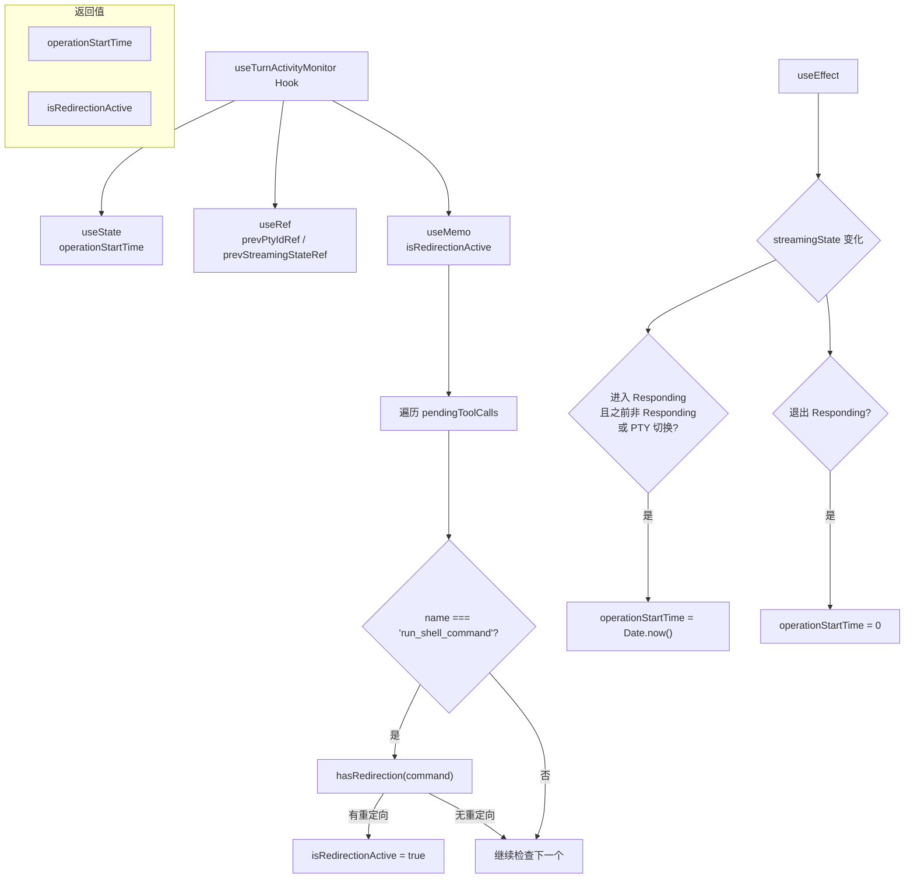

# useTurnActivityMonitor.ts

> 监控 Gemini 对话轮次的活动状态，检测操作开始时间和 Shell 重定向的 React Hook。

## 概述

`useTurnActivityMonitor` 用于追踪 Gemini 对话轮次（turn）的活动状态。它监测两个关键指标：1）当前操作的开始时间（`operationStartTime`），在进入响应状态或活跃 PTY 切换时重置；2）是否存在活跃的 Shell 重定向（`isRedirectionActive`），用于判断是否应抑制不活跃提示。该 Hook 常用于超时检测和用户提示等 UI 行为的决策依据。

## 架构图

## 主要导出

| 导出名称 | 类型 | 说明 |
|---|---|---|
| `TurnActivityStatus` | `interface` | 返回值类型，包含 `operationStartTime: number` 和 `isRedirectionActive: boolean` |
| `useTurnActivityMonitor` | `function` | 主 Hook 函数 |

### 参数

| 参数 | 类型 | 默认值 | 说明 |
|---|---|---|---|
| `streamingState` | `StreamingState` | - | 当前流式状态（如 Responding、Idle 等） |
| `activePtyId` | `number \| string \| null \| undefined` | - | 当前活跃的 PTY（伪终端）标识 |
| `pendingToolCalls` | `TrackedToolCall[]` | `[]` | 待处理的工具调用列表 |

### TurnActivityStatus 接口

| 字段 | 类型 | 说明 |
|---|---|---|
| `operationStartTime` | `number` | 当前操作的开始时间戳（ms），非响应状态时为 0 |
| `isRedirectionActive` | `boolean` | 是否有工具调用包含 Shell 重定向操作 |

## 核心逻辑

1. **操作开始时间追踪**：通过 `useEffect` 监听 `streamingState` 和 `activePtyId` 的变化。当状态首次进入 `StreamingState.Responding`（从非 Responding 状态转入），或在 Responding 期间 `activePtyId` 发生变化（表示轮次内有新命令开始执行），将 `operationStartTime` 设置为 `Date.now()`。当退出 Responding 状态时归零为 0。

2. **PTY 变化检测**：使用 `useRef` 保存上一次的 `activePtyId`（`prevPtyIdRef`）和 `streamingState`（`prevStreamingStateRef`），通过与当前值比较来检测状态转换和 PTY 切换。

3. **重定向检测**：通过 `useMemo` 在渲染阶段直接计算 `isRedirectionActive`。遍历 `pendingToolCalls`，筛选名为 `run_shell_command` 的工具调用，提取其 `command` 参数（类型断言为 `{ command?: string }`），使用核心库的 `hasRedirection` 工具函数检测是否包含 Shell 重定向操作符（如 `>`、`>>`、`|` 等）。

4. **渲染时计算**：`isRedirectionActive` 使用 `useMemo` 而非 `useEffect` + `useState`，确保从第一帧渲染开始就能获得准确的值，避免延迟一帧的闪烁问题。

## 内部依赖

| 模块 | 说明 |
|---|---|
| `../types.js` | 提供 `StreamingState` 枚举，定义流式状态（如 Responding） |
| `./useToolScheduler.js` | 提供 `TrackedToolCall` 类型，带 UI 元数据的工具调用 |

## 外部依赖

| 模块 | 说明 |
|---|---|
| `react` | 使用 `useState`、`useEffect`、`useRef`、`useMemo` |
| `@google/gemini-cli-core` | 提供 `hasRedirection` 函数，用于检测 Shell 命令中的重定向操作符 |
