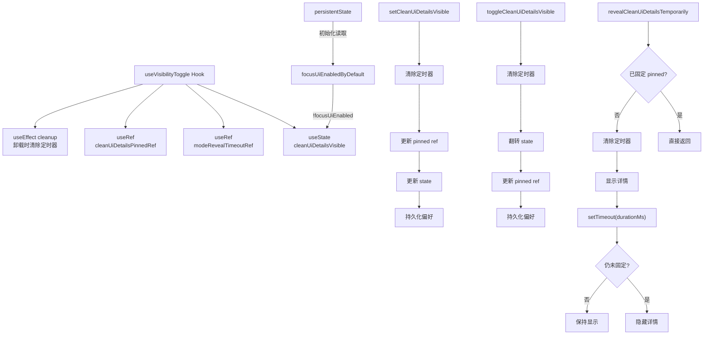

# useVisibilityToggle.ts

> 管理 UI 细节面板显示/隐藏状态的 React Hook，支持持久化偏好、切换及临时显示。

## 概述

`useVisibilityToggle` 控制"清洁 UI"（Focus UI）模式下详情面板的可见性。它从持久化状态中读取用户的 Focus UI 偏好作为初始值，提供直接设置、切换、以及临时显示（到期自动隐藏）三种操作方式。用户的显示偏好会被持久化保存，确保跨会话的一致体验。临时显示功能适用于审批模式等需要短暂展示详情的场景，且不会覆盖用户的显式偏好（pinned 状态）。

## 架构图

## 主要导出

| 导出名称 | 类型 | 说明 |
|---|---|---|
| `APPROVAL_MODE_REVEAL_DURATION_MS` | `const number` | 审批模式下临时显示的默认持续时间，值为 `1200` 毫秒 |
| `useVisibilityToggle` | `function` | 主 Hook 函数，无参数 |

### 内部常量

| 名称 | 值 | 说明 |
|---|---|---|
| `FOCUS_UI_ENABLED_STATE_KEY` | `'focusUiEnabled'` | 持久化存储中 Focus UI 偏好的键名 |

### 返回值

| 字段 | 类型 | 说明 |
|---|---|---|
| `cleanUiDetailsVisible` | `boolean` | 当前详情面板是否可见 |
| `setCleanUiDetailsVisible` | `(visible: boolean) => void` | 直接设置详情面板可见性（持久化并更新 pinned 状态） |
| `toggleCleanUiDetailsVisible` | `() => void` | 切换详情面板可见性（持久化并更新 pinned 状态） |
| `revealCleanUiDetailsTemporarily` | `(durationMs?: number) => void` | 临时显示详情面板，到期自动隐藏（默认 1200ms），不改变 pinned 状态 |

## 核心逻辑

1. **初始状态读取**：通过 `useState` 惰性初始化从 `persistentState` 读取 `focusUiEnabled` 键值。若 Focus UI 已启用（值为 `true`），则详情面板默认隐藏（`cleanUiDetailsVisible = false`）；否则默认显示。同时初始化 `cleanUiDetailsPinnedRef` 为与可见性一致的值。

2. **固定状态（pinned）**：`cleanUiDetailsPinnedRef` 是一个 `useRef`，记录用户是否主动设置了面板显示状态。只有用户通过 `setCleanUiDetailsVisible` 或 `toggleCleanUiDetailsVisible` 主动操作时，才会更新 pinned 状态。临时显示（`revealCleanUiDetailsTemporarily`）不改变 pinned 状态。

3. **直接设置**：`setCleanUiDetailsVisible(visible)` 先清除任何临时显示的定时器，然后更新 `pinned ref`、`state` 和持久化偏好，三者保持同步。

4. **切换操作**：`toggleCleanUiDetailsVisible` 使用函数式更新翻转当前可见性状态，同步更新 pinned ref 并通过 `persistFocusUiPreference` 持久化。

5. **临时显示**：`revealCleanUiDetailsTemporarily(durationMs)` 先检查 `cleanUiDetailsPinnedRef.current`，若已固定则不操作（避免覆盖用户的显式选择）。否则清除旧定时器，立即显示面板，并设置 `setTimeout`。到期后检查 pinned 状态——若期间用户主动固定了面板则保持显示，否则自动隐藏。默认持续时间为 `APPROVAL_MODE_REVEAL_DURATION_MS`（1200ms）。

6. **持久化**：`persistFocusUiPreference` 通过 `persistentState.set(FOCUS_UI_ENABLED_STATE_KEY, !isFullUiVisible)` 将 Focus UI 偏好写入持久化存储。注意逻辑取反：`isFullUiVisible = true` 意味着 Focus UI 被禁用。

7. **清理**：`useEffect` 在组件卸载时调用 `clearModeRevealTimeout` 清除残留的临时显示定时器。

## 内部依赖

| 模块 | 说明 |
|---|---|
| `../../utils/persistentState.js` | 提供 `persistentState` 对象，用于跨会话持久化用户的 Focus UI 偏好 |

## 外部依赖

| 模块 | 说明 |
|---|---|
| `react` | 使用 `useState`、`useRef`、`useCallback`、`useEffect` |
