# vim.ts

> React Hook（约 1525 行），为文本输入框提供完整的 Vim 风格模态编辑功能，支持 NORMAL/INSERT 模式、移动、删除、修改、查找、复制粘贴和命令重复。

## 概述

`vim.ts` 实现了 `useVim` Hook，为 CLI 的输入框提供了全面的 Vim 键绑定支持。特性包括：

1. **双模态编辑**：INSERT 模式（正常输入）和 NORMAL 模式（命令模式）之间切换。
2. **移动命令**：`h/j/k/l`（方向）、`w/b/e/W/B/E`（单词）、`0/$` ^`（行首/尾）、`gg/G`（首尾行）、`f/F/t/T`（字符查找）、`;/,`（重复查找），全部支持数字前缀。
3. **编辑命令**：`x/X`（删除字符）、`d{motion}`（删除）、`c{motion}`（修改）、`dd/cc`（整行操作）、`D/C`（删除/修改到行尾）、`~`（大小写切换）、`r`（替换字符）。
4. **复制粘贴**：`yy`（复制行）、`y{motion}`（复制范围）、`Y`/`y$`（复制到行尾）、`p/P`（粘贴）。
5. **模式进入**：`i/a/o/O/I/A`（多种方式进入 INSERT 模式）。
6. **命令重复**：`.` 键重复上一个编辑命令，支持覆盖计数。
7. **撤销**：`u` 撤销操作。
8. **双 Escape 清除**：在 NORMAL 模式下快速连按两次 Escape 清空输入内容。

## 架构图

```mermaid
flowchart TD
    A[键盘输入] --> B{Vim 启用?}
    B -- 否 --> C[交由 InputPrompt 处理]
    B -- 是 --> D[normalizeKey]
    D --> E{当前模式}

    E -- INSERT --> F[handleInsertModeInput]
    F --> F1{Escape?}
    F1 -- 是 --> F2[切换到 NORMAL]
    F1 -- 否 --> F3{特殊键? tab/enter/up/down/ctrl+r/ctrl+u/ctrl+k/ctrl+v}
    F3 -- 是 --> F4[交由 InputPrompt 处理]
    F3 -- 否 --> F5["buffer.handleInput()"]

    E -- NORMAL --> G[handleInput NORMAL 分支]
    G --> G0{Ctrl+C?}
    G0 -- 是 --> C

    G --> G1{Escape?}
    G1 -- 有 pending --> G2[清除 pending 状态]
    G1 -- 双击 Escape --> G3[清空 buffer]
    G1 -- 单次 --> G4[传递给 UI]

    G --> G5{数字 1-9 或 0且count>0?}
    G5 -- 是 --> G6[累积 count]

    G --> G7{pendingFindOp?}
    G7 -- 是 --> G8[执行 find/replace 操作]

    G --> G9{具体命令}
    G9 -- h/j/k/l --> H[移动 + 检查 pending d/c]
    G9 -- w/b/e/W/B/E --> I[单词移动 + 检查 pending d/c/y]
    G9 -- x/X --> J[删除字符]
    G9 -- "~/r" --> K[切换大小写/替换]
    G9 -- d --> L{pending d?}
    L -- 是 --> L1[dd 删除整行]
    L -- 否 --> L2[设置 pending d]
    G9 -- c --> M{pending c?}
    M -- 是 --> M1[cc 修改整行]
    M -- 否 --> M2[设置 pending c]
    G9 -- y --> N{pending y?}
    N -- 是 --> N1[yy 复制行]
    N -- 否 --> N2[设置 pending y]
    G9 -- "0/$" /^ --> O[行首/尾移动 + 检查 pending d/c]
    G9 -- g/G --> P[首尾行跳转 + 支持 dgg/cgg/dG/cG]
    G9 -- i/a/o/O/I/A --> Q[进入 INSERT]
    G9 -- D/C --> R[删除/修改到行尾]
    G9 -- "f/F/t/T" --> S[设置 pendingFindOp]
    G9 -- p/P --> T[粘贴]
    G9 -- Y --> U[复制到行尾]
    G9 -- u --> V[撤销]
    G9 -- "." --> W[重复上次命令]
    G9 -- 箭头键 --> X[方向移动 + 检查 pending d/c]

    subgraph 状态管理 vimReducer
        ST[mode: NORMAL/INSERT]
        CT[count: 数字前缀]
        PO["pendingOperator: g/d/c/y/dg/cg"]
        PF["pendingFindOp: f/F/t/T/r"]
        LC[lastCommand: 用于 . 重复]
        LF["lastFind: 用于 ;/, 重复"]
    end
```

## 主要导出

| 导出项 | 类型 | 说明 |
|--------|------|------|
| `useVim` | `(buffer: TextBuffer, onSubmit?: (value: string) => void) => { mode, vimModeEnabled, handleInput }` | Vim 模态编辑 Hook |
| `VimMode` | `type 'NORMAL' \| 'INSERT'` | Vim 模式类型 |

### Hook 返回值

| 字段 | 类型 | 说明 |
|------|------|------|
| `mode` | `VimMode` | 当前 Vim 模式 |
| `vimModeEnabled` | `boolean` | Vim 模式是否全局启用 |
| `handleInput` | `(key: Key) => boolean` | 键盘输入处理函数，返回 `true` 表示已消费该按键 |

## 核心逻辑

### 状态管理 (`vimReducer`)

使用 `useReducer` 管理以下状态：

| 状态 | 类型 | 说明 |
|------|------|------|
| `mode` | `VimMode` | 当前编辑模式 |
| `count` | `number` | 数字前缀累积（如 `3dw` 中的 `3`） |
| `pendingOperator` | `'g' \| 'd' \| 'c' \| 'y' \| 'dg' \| 'cg' \| null` | 等待 motion 的操作符 |
| `pendingFindOp` | `PendingFindOp \| undefined` | 等待目标字符的查找/替换操作 |
| `lastCommand` | `{ type, count, char? } \| null` | 上一个编辑命令（用于 `.` 重复） |
| `lastFind` | `{ op, char } \| undefined` | 上一个查找操作（用于 `;/,` 重复） |

**Reducer Action 类型**：`SET_MODE`、`SET_COUNT`、`INCREMENT_COUNT`、`CLEAR_COUNT`、`SET_PENDING_OPERATOR`、`SET_PENDING_FIND_OP`、`SET_LAST_FIND`、`SET_LAST_COMMAND`、`CLEAR_PENDING_STATES`、`ESCAPE_TO_NORMAL`。

### `handleInput(key)` - 主入口

1. 若 Vim 未启用，返回 `false`。
2. `Ctrl+C` 始终传递给 InputPrompt 处理。
3. INSERT 模式：委托给 `handleInsertModeInput`。
4. NORMAL 模式：按顺序处理 Escape -> 数字前缀 -> pendingFindOp -> 具体命令。

### `handleInsertModeInput(normalizedKey)` - INSERT 模式处理

- **Escape**：切换到 NORMAL 模式，记录时间戳用于双 Escape 检测。
- **特殊键**（Tab、Enter、上下箭头、Ctrl+R/U/K/V）：返回 `false` 交由 InputPrompt 处理补全、历史导航、剪贴板等功能。
- **`!` 且空 buffer**：允许 Shell 命令触发。
- **Enter**（非修饰键）：若 buffer 有内容且有 `onSubmit` 回调，提交命令。
- **其他键**：调用 `buffer.handleInput(normalizedKey)` 处理常规输入。

### `executeCommand(cmdType, count, char?)` - 命令执行器

统一的命令执行函数，通过 `CMD_TYPES` 常量映射到 `buffer` 的 Vim 方法。所有可重复的编辑命令（50+ 种）都通过此函数执行，使 `.` 重复命令的实现非常简洁。

### 操作符-动作 (Operator-Motion) 模式

Vim 的核心范式，实现了：

- **`d{motion}`**：`dw/db/de/dW/dB/dE`（删除到单词边界）、`dh/dj/dk/dl`（删除方向）、`d0/d$/d^`（删除到行首/尾）、`dgg/dG`（删除到首/尾行）
- **`c{motion}`**：同上，但执行后进入 INSERT 模式
- **`y{motion}`**：`yw/yW/ye/yE/y$`（复制范围）

### 查找/替换操作

- `f/F/t/T`：设置 `pendingFindOp`，下一个按键作为目标字符。支持与 `d`/`c` 操作符组合（如 `df)`、`ct.`）。
- `r`：设置 `pendingFindOp`（op 为 `'r'`），下一个按键替换光标下字符。
- `;/,`：重复/反向重复上一次 `f/F/t/T` 查找。

### 双 Escape 检测

通过 `lastEscapeTimestampRef` 追踪 Escape 按键时间。两次 Escape 间隔在 500ms 以内时视为双击，清空 buffer 内容。从 INSERT 模式按 Escape 时也记录时间戳，使得 INSERT -> NORMAL -> Escape(清空) 的操作流畅。

### 模式同步

通过 `useVimMode()` Context 获取全局 Vim 模式状态，并在 `useEffect` 中将 Context 变化同步到 reducer 状态。`updateMode` 函数同时更新 Context 和 reducer。

## 内部依赖

| 模块 | 导入项 | 用途 |
|------|--------|------|
| `./useKeypress.js` | `Key` | 按键事件类型 |
| `../components/shared/text-buffer.js` | `TextBuffer` | 文本缓冲区接口（提供所有 vim 操作方法） |
| `../contexts/VimModeContext.js` | `useVimMode` | 全局 Vim 模式 Context |
| `../key/keyMatchers.js` | `Command` | 按键匹配命令枚举 |
| `./useKeyMatchers.js` | `useKeyMatchers` | 按键匹配器 Hook |
| `../utils/textUtils.js` | `toCodePoints` | Unicode code point 处理（验证单字符输入） |

## 外部依赖

| 模块 | 导入项 | 用途 |
|------|--------|------|
| `react` | `useCallback`, `useReducer`, `useEffect`, `useRef` | React Hook 基础设施 |
| `@google/gemini-cli-core` | `debugLogger` | 调试日志（处理畸形按键输入） |
