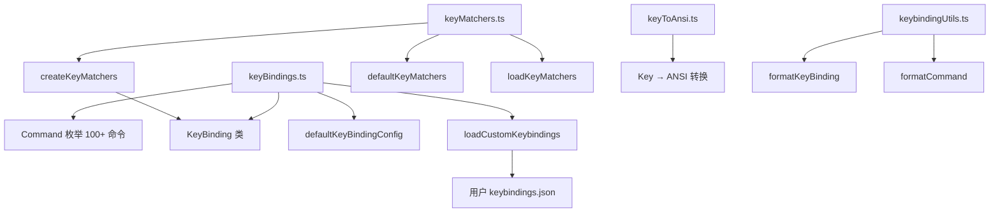

# key 架构

> 键盘绑定系统，定义和管理所有键盘快捷键的绑定、匹配和显示

## 概述

`key` 目录实现了 Gemini CLI 完整的键盘绑定系统。它定义了所有可用的键盘命令（Command 枚举）、默认绑定配置、用户自定义绑定加载、按键匹配逻辑、按键到 ANSI 转义序列的转换，以及绑定的人类可读格式化。该系统支持 100+ 个命令，涵盖基本控制、光标移动、编辑、滚动、历史搜索、导航、补全、应用控制和后台 Shell 控制。

## 架构图



## 目录结构

```
key/
├── keyBindings.ts      # Command 枚举、KeyBinding 类、默认绑定配置、自定义绑定加载
├── keyMatchers.ts      # 键匹配器创建和导出
├── keyToAnsi.ts        # 按键到 ANSI 转义序列转换
└── keybindingUtils.ts  # 绑定格式化工具（平台感知）
```

## 关键文件

| 文件 | 功能 |
|------|------|
| `keyBindings.ts` | 核心文件：定义 Command 枚举（10 个类别 100+ 命令）、KeyBinding 类（解析 "Ctrl+C" 格式）、默认绑定映射、命令分类和描述、用户 keybindings.json 加载 |
| `keyMatchers.ts` | `createKeyMatchers` 从配置创建命令匹配器映射，`loadKeyMatchers` 合并用户自定义绑定 |
| `keyToAnsi.ts` | `keyToAnsi` 将 Key 对象转为 ANSI 序列，用于向 PTY 发送控制字符 |
| `keybindingUtils.ts` | `formatKeyBinding` 将绑定格式化为人类可读字符串，`formatCommand` 获取命令的主绑定显示文本，支持 macOS/Windows/Linux 平台差异 |

## 内部依赖

- `../hooks/useKeypress` - Key 类型定义
- `../contexts/KeypressContext` - Key 类型（keyToAnsi 使用）

## 外部依赖

| 包名 | 用途 |
|------|------|
| `zod` | 用户 keybindings.json 的 schema 校验 |
| `comment-json` | 解析带注释的 JSON 文件 |
| `@google/gemini-cli-core` | Storage（获取 keybindings.json 路径）、isNodeError |
| `node:fs/promises` | 异步读取用户配置文件 |
| `node:process` | 获取当前平台（darwin/win32/linux） |
