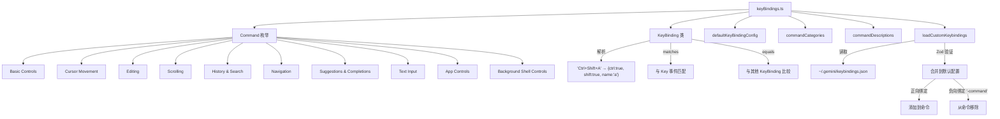

# keyBindings.ts

> 定义完整的键盘快捷键绑定系统，包括 Command 枚举、KeyBinding 类、默认配置和用户自定义加载

## 概述

`keyBindings.ts` 是 CLI 键盘快捷键系统的核心模块（约 730 行）。它定义了所有可绑定的命令（`Command` 枚举，9 大类共 60+ 命令）、键绑定数据结构（`KeyBinding` 类，支持修饰键解析和匹配）、默认键绑定配置、命令分类元数据、命令描述，以及从用户 `keybindings.json` 文件加载自定义绑定的功能。

## 架构图（mermaid）

## 主要导出

| 名称 | 类型 | 说明 |
|------|------|------|
| `Command` | `enum` | 60+ 个可绑定命令，按 9 大类组织 |
| `KeyBinding` | `class` | 键绑定数据结构，支持从模式字符串构造、匹配和比较 |
| `KeyBindingConfig` | `type` | `Map<Command, readonly KeyBinding[]>` |
| `defaultKeyBindingConfig` | `KeyBindingConfig` | 内置默认键绑定配置 |
| `commandCategories` | `CommandCategory[]` | 命令分类元数据（用于文档/UI 分组显示） |
| `commandDescriptions` | `Record<Command, string>` | 每个命令的人类可读描述 |
| `loadCustomKeybindings` | `async function` | 加载用户自定义键绑定并与默认配置合并 |

## 核心逻辑

### KeyBinding 类
- 构造函数解析键绑定模式字符串（如 `"Ctrl+Shift+A"`），支持 `Ctrl+`、`Shift+`、`Alt+`、`Option+`、`Opt+`、`Cmd+`、`Meta+` 前缀
- 验证键名合法性：单字符或预定义的特殊键名（`enter`、`escape`、`f1`-`f35`、箭头键等）
- `matches(key)` 方法与运行时 `Key` 事件精确匹配（名称 + 所有修饰键）
- `equals(other)` 方法用于键绑定比较

### 默认键绑定配置
- 每个命令可绑定多个快捷键（如 `HOME` = `Ctrl+A` 或 `Home`）
- 涵盖基础控制、光标移动、编辑、滚动、历史搜索、导航、建议补全、文本输入、应用控制、后台 Shell 控制

### 用户自定义加载
- 从 `Storage.getUserKeybindingsPath()` 读取 JSON 文件
- 使用 Zod Schema 验证格式
- 支持正向绑定（添加新快捷键到命令前端）和负向绑定（`-command` 移除已有快捷键）
- 错误安全：文件不存在则静默使用默认配置

## 内部依赖

| 模块 | 用途 |
|------|------|
| `../hooks/useKeypress.js` → `Key` | 按键事件类型 |

## 外部依赖

| 模块 | 用途 |
|------|------|
| `node:fs/promises` | 异步文件读取 |
| `zod` | Schema 验证 |
| `comment-json` | 支持注释的 JSON 解析 |
| `@google/gemini-cli-core` | `isNodeError`, `Storage` |
