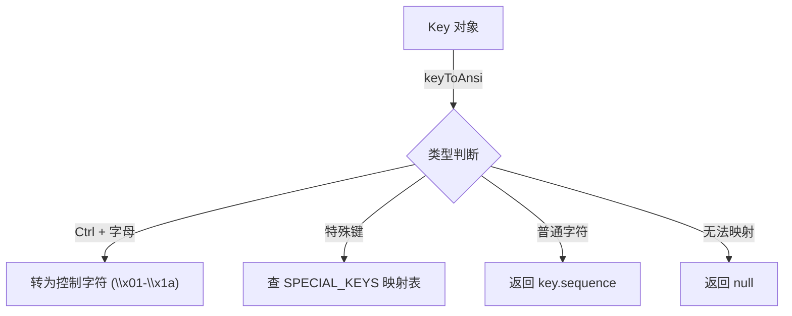

# keyToAnsi.ts

> 将 Key 对象转换为对应的 ANSI 转义序列，用于向伪终端发送控制字符

## 概述

`keyToAnsi.ts` 提供一个转换函数，将 UI 层的 `Key` 对象翻译为终端能理解的 ANSI 转义序列。这在需要将用户按键转发到伪终端（PTY）时使用，例如在嵌入式 Shell 中传递按键输入。

## 架构图（mermaid）

## 主要导出

| 名称 | 类型 | 说明 |
|------|------|------|
| `Key` | re-export | 从 `KeypressContext` 重新导出的按键类型 |
| `keyToAnsi` | `function` | 将 `Key` 对象转为 ANSI 转义序列字符串或 `null` |

## 核心逻辑

1. **Ctrl + 字母**：Ctrl+A 到 Ctrl+Z 映射为 `\x01` 到 `\x1a`（ASCII 控制字符）
2. **特殊键映射**（`SPECIAL_KEYS` 表）：
   - 方向键：`up`→`\x1b[A`、`down`→`\x1b[B`、`right`→`\x1b[C`、`left`→`\x1b[D`
   - `escape`→`\x1b`、`tab`→`\t`、`enter`→`\r`
   - `backspace`→`\x7f`、`delete`→`\x1b[3~`
   - `home`→`\x1b[H`、`end`→`\x1b[F`
   - `pageup`→`\x1b[5~`、`pagedown`→`\x1b[6~`
3. **普通字符**：非修饰键的字符直接返回 `key.sequence`
4. **无法映射**：无法识别的组合返回 `null`

## 内部依赖

| 模块 | 用途 |
|------|------|
| `../contexts/KeypressContext.js` → `Key` | 按键事件类型定义 |

## 外部依赖

无
