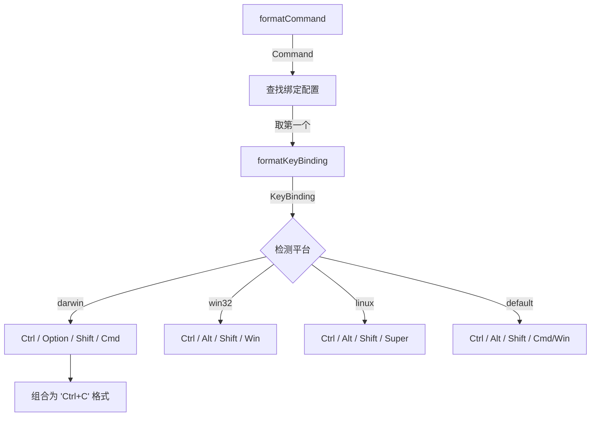

# keybindingUtils.ts

> 将键绑定格式化为人类可读的快捷键提示字符串

## 概述

`keybindingUtils.ts` 提供键绑定到用户友好显示字符串的转换功能。它根据操作系统平台（macOS/Windows/Linux）使用不同的修饰键名称（如 macOS 上 Alt 显示为 "Option"），并将 `KeyBinding` 对象或 `Command` 枚举值转换为 `"Ctrl+C"` 这样的格式化字符串。

## 架构图（mermaid）

## 主要导出

| 名称 | 类型 | 说明 |
|------|------|------|
| `formatKeyBinding` | `function` | 将单个 `KeyBinding` 格式化为可读字符串（如 `"Option+M"`） |
| `formatCommand` | `function` | 获取命令的主要键绑定并格式化 |

## 核心逻辑

1. **平台感知**：通过 `process.platform` 或 `FORCE_GENERIC_KEYBINDING_HINTS` 环境变量确定平台
2. **修饰键映射**：每个平台有独立的修饰键名称映射（`ModifierMap`）
3. **键名映射**：特殊键名（`enter`→`Enter`、`escape`→`Esc`、`pageup`→`Page Up` 等）转为可读名称
4. **格式化规则**：修饰键按 Ctrl → Alt → Shift → Cmd 顺序排列，以 `+` 连接

## 内部依赖

| 模块 | 用途 |
|------|------|
| `./keyBindings.js` | `Command`, `KeyBinding`, `KeyBindingConfig`, `defaultKeyBindingConfig` |

## 外部依赖

| 模块 | 用途 |
|------|------|
| `node:process` | 平台检测 |
