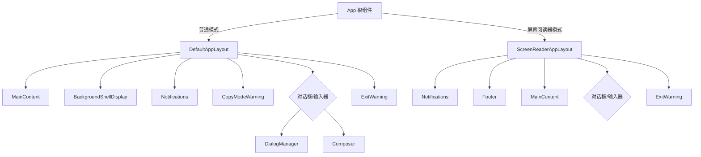

# layouts 架构

> 布局组件，定义 Gemini CLI 的两种终端界面布局模式

## 概述

`layouts` 目录包含 Gemini CLI 的两种布局组件：默认布局和屏幕阅读器布局。默认布局优化了视觉体验，支持备用屏幕缓冲区和后台 Shell；屏幕阅读器布局则优化了无障碍访问性。App 根组件根据 `isScreenReaderEnabled` 设置选择使用哪种布局。

## 架构图



## 目录结构

```
layouts/
├── DefaultAppLayout.tsx        # 默认应用布局
└── ScreenReaderAppLayout.tsx   # 屏幕阅读器无障碍布局
```

## 关键文件

| 文件 | 功能 |
|------|------|
| `DefaultAppLayout.tsx` | 默认布局：主内容区 → 后台 Shell → 通知/CopyMode 警告 → 对话框或输入器 → 退出警告。支持备用屏幕缓冲区模式下的固定高度和滚动条 |
| `ScreenReaderAppLayout.tsx` | 屏幕阅读器布局：通知 → 页脚 → 主内容 → 对话框或输入器 → 退出警告。使用 90% 宽度，页脚置于内容之前以便屏幕阅读器优先读取 |

## 内部依赖

- `../components/MainContent` - 主内容区域
- `../components/Composer` - 输入组合器
- `../components/DialogManager` - 对话框管理
- `../components/Notifications` - 通知区
- `../components/Footer` - 页脚（仅屏幕阅读器布局）
- `../components/ExitWarning` - 退出警告
- `../components/CopyModeWarning` - 复制模式警告
- `../components/BackgroundShellDisplay` - 后台 Shell 显示
- `../contexts/UIStateContext` - UI 状态
- `../hooks/useFlickerDetector` - 闪烁检测
- `../hooks/useAlternateBuffer` - 备用缓冲区
- `../types` - StreamingState

## 外部依赖

| 包名 | 用途 |
|------|------|
| `ink` | Box 布局组件 |
| `react` | React.FC 类型 |
