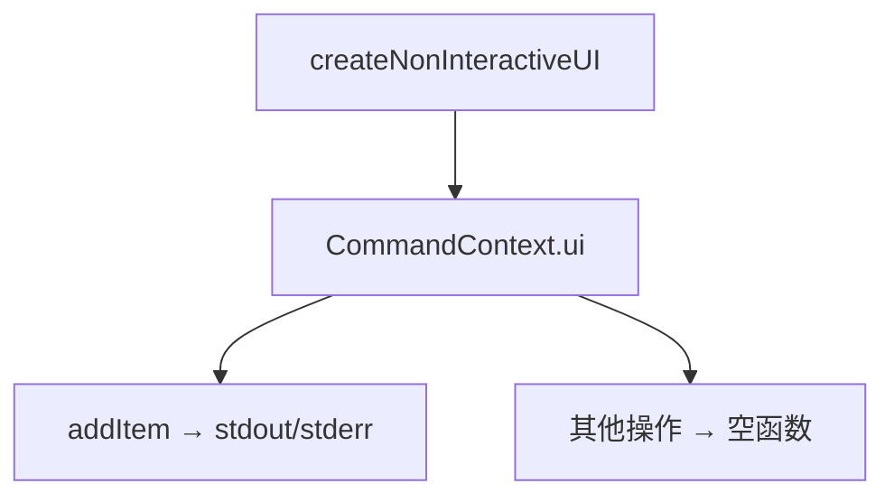

# noninteractive 架构

> 非交互模式 UI 适配器，为无终端界面的环境提供命令执行支持

## 概述

`noninteractive` 目录提供了一个非交互式的 UI 上下文适配器。当 Gemini CLI 在无交互式终端的环境中运行时（如 CI/CD 管道或脚本调用），此适配器将 UI 操作替换为标准输出/错误输出，使命令系统无需交互式终端即可运行。

## 架构图



## 目录结构

```
noninteractive/
└── nonInteractiveUi.ts  # 非交互式 UI 上下文工厂
```

## 关键文件

| 文件 | 功能 |
|------|------|
| `nonInteractiveUi.ts` | `createNonInteractiveUI()` 工厂函数，返回 `CommandContext['ui']` 兼容对象。`addItem` 将 info 写到 stdout、error/warning 写到 stderr，其余方法为空操作 |

## 内部依赖

- `../commands/types` - CommandContext 类型
- `../state/extensions` - ExtensionUpdateAction 类型

## 外部依赖

无（仅使用 Node.js 内置 `process.stdout`/`process.stderr`）。
