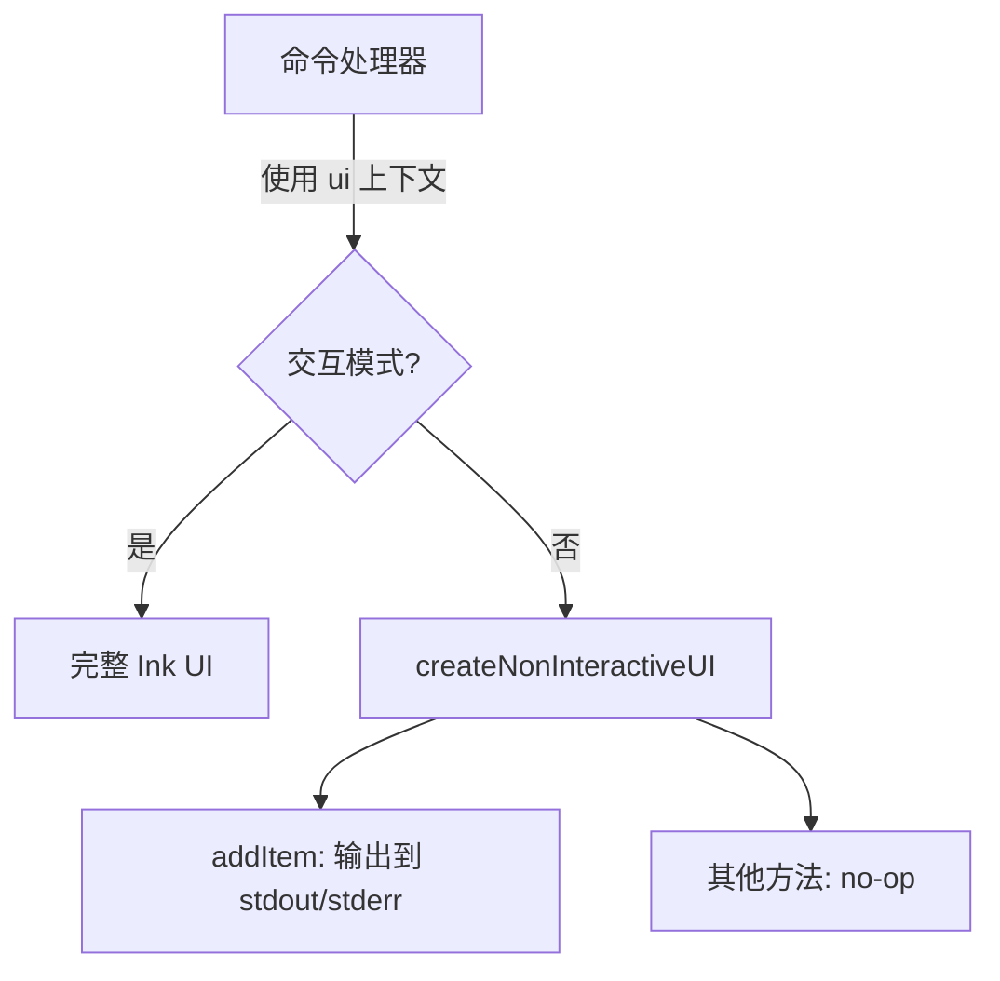

# nonInteractiveUi.ts

> 为非交互式环境提供空操作（no-op）UI 上下文实现

## 概述

`nonInteractiveUi.ts` 创建一个符合 `CommandContext['ui']` 接口的对象，其中大部分操作为空函数。这使得在无终端 UI 的环境（如 CI/CD 管道、脚本调用）中，命令处理逻辑仍能正常执行而不会因缺少 UI 层而报错。唯一有实际效果的操作是 `addItem`：错误和警告输出到 `stderr`，信息输出到 `stdout`。

## 架构图（mermaid）

## 主要导出

| 名称 | 类型 | 说明 |
|------|------|------|
| `createNonInteractiveUI` | `function` | 返回一个实现了 `CommandContext['ui']` 接口的非交互式 UI 对象 |

## 核心逻辑

- `addItem`：根据 `item.type` 将文本输出到对应流
  - `'error'` → `process.stderr.write`（带 "Error: " 前缀）
  - `'warning'` → `process.stderr.write`（带 "Warning: " 前缀）
  - `'info'` → `process.stdout.write`
- 其他方法（`clear`、`setDebugMessage`、`loadHistory`、`toggleCorgiMode`、`toggleVimEnabled` 等）均为空实现
- `pendingItem` 固定为 `null`
- `extensionsUpdateState` 为空 `Map`

## 内部依赖

| 模块 | 用途 |
|------|------|
| `../commands/types.js` → `CommandContext` | UI 上下文接口类型 |
| `../state/extensions.js` → `ExtensionUpdateAction` | 扩展更新动作类型 |

## 外部依赖

无
