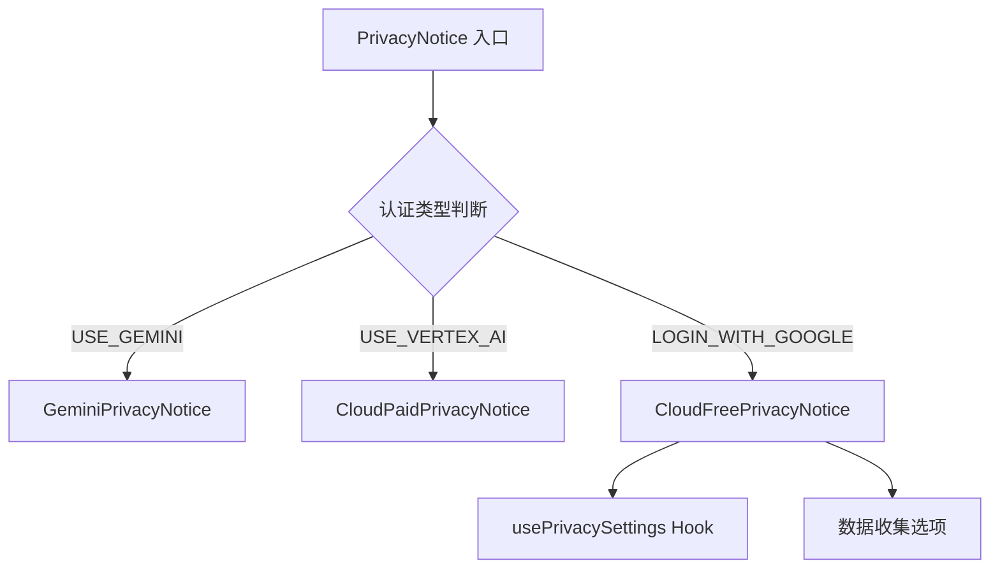

# privacy 架构

> 隐私通知组件，根据认证类型显示对应的数据使用和隐私政策信息

## 概述

`privacy` 目录包含隐私通知相关的 UI 组件。Gemini CLI 根据用户的认证方式（Gemini API Key、Google 登录免费版、Vertex AI 付费版）显示不同的隐私政策说明。用户可以通过 `/privacy` 命令随时查看适用的隐私条款。

## 架构图



## 目录结构

```
privacy/
├── PrivacyNotice.tsx         # 隐私通知入口组件，路由到对应的通知类型
├── GeminiPrivacyNotice.tsx   # Gemini API Key 隐私通知
├── CloudFreePrivacyNotice.tsx # Google 登录（免费版）隐私通知，含数据收集选项
└── CloudPaidPrivacyNotice.tsx # Vertex AI（付费版）隐私通知
```

## 关键文件

| 文件 | 功能 |
|------|------|
| `PrivacyNotice.tsx` | 入口组件，根据 `config.getContentGeneratorConfig()?.authType` 路由到对应的隐私通知组件 |
| `GeminiPrivacyNotice.tsx` | Gemini API Key 用户的隐私政策说明，按 Esc 关闭 |
| `CloudFreePrivacyNotice.tsx` | Google 登录免费版用户的隐私通知，包含数据收集 opt-in 选项，使用 `usePrivacySettings` Hook |
| `CloudPaidPrivacyNotice.tsx` | Vertex AI 付费版用户的隐私政策说明，按 Esc 关闭 |

## 内部依赖

- `../components/shared/RadioButtonSelect` - 单选选项（CloudFree 使用）
- `../hooks/useKeypress` - Esc 键处理
- `../hooks/usePrivacySettings` - 隐私设置状态管理
- `../semantic-colors` - 语义颜色

## 外部依赖

| 包名 | 用途 |
|------|------|
| `ink` | Box、Text、Newline 组件 |
| `@google/gemini-cli-core` | Config、AuthType |
