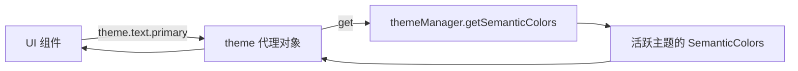

# semantic-colors.ts

> 通过懒加载代理模式提供语义化主题颜色的全局访问入口

## 概述

`semantic-colors.ts` 导出一个 `theme` 对象，与 `colors.ts` 类似采用 getter 代理模式，但提供的是**语义化颜色**（Semantic Colors），即按用途分类的颜色，如 `text.primary`、`status.error`、`background.input` 等。这使得 UI 组件可以按照语义而非具体色值引用颜色，提高主题适配性。

## 架构图（mermaid）

## 主要导出

| 名称 | 类型 | 说明 |
|------|------|------|
| `theme` | `SemanticColors` | 语义化颜色代理对象，包含 `text`、`background`、`border`、`ui`、`status` 五大类 |

## 核心逻辑

- 五个顶级属性（`text`、`background`、`border`、`ui`、`status`）均通过 getter 委托给 `themeManager.getSemanticColors()`
- `getSemanticColors()` 会根据终端背景色动态调整背景相关颜色

## 内部依赖

| 模块 | 用途 |
|------|------|
| `./themes/theme-manager.js` → `themeManager` | 主题管理器单例 |
| `./themes/semantic-tokens.js` → `SemanticColors` | 语义化颜色接口定义 |

## 外部依赖

无
