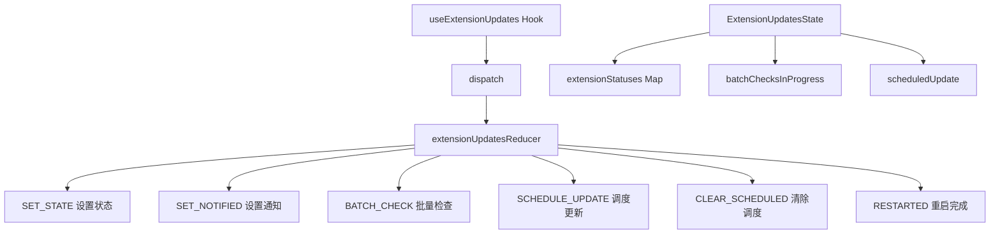

# state 架构

> UI 状态管理模块，使用 Reducer 模式管理扩展更新状态

## 概述

`state` 目录包含 UI 层的独立状态管理逻辑。目前主要管理扩展（Extension）更新相关的状态，使用 Redux 风格的 Reducer 模式。该模块定义了扩展更新的状态枚举、Action 类型和纯函数 Reducer，被 `useExtensionUpdates` Hook 消费。

## 架构图



## 目录结构

```
state/
└── extensions.ts  # 扩展更新状态定义和 Reducer
```

## 关键文件

| 文件 | 功能 |
|------|------|
| `extensions.ts` | 定义 `ExtensionUpdateState` 枚举（8 种状态：检查中/已更新需重启/已更新/更新中/有可用更新/已是最新/错误/不可更新/未知）、`ExtensionUpdatesState` 状态结构、7 种 `ExtensionUpdateAction` 以及纯函数 `extensionUpdatesReducer` |

## 内部依赖

- `../../config/extension` - ExtensionUpdateInfo 类型

## 外部依赖

| 包名 | 用途 |
|------|------|
| `@google/gemini-cli-core` | checkExhaustive（穷尽性检查） |
