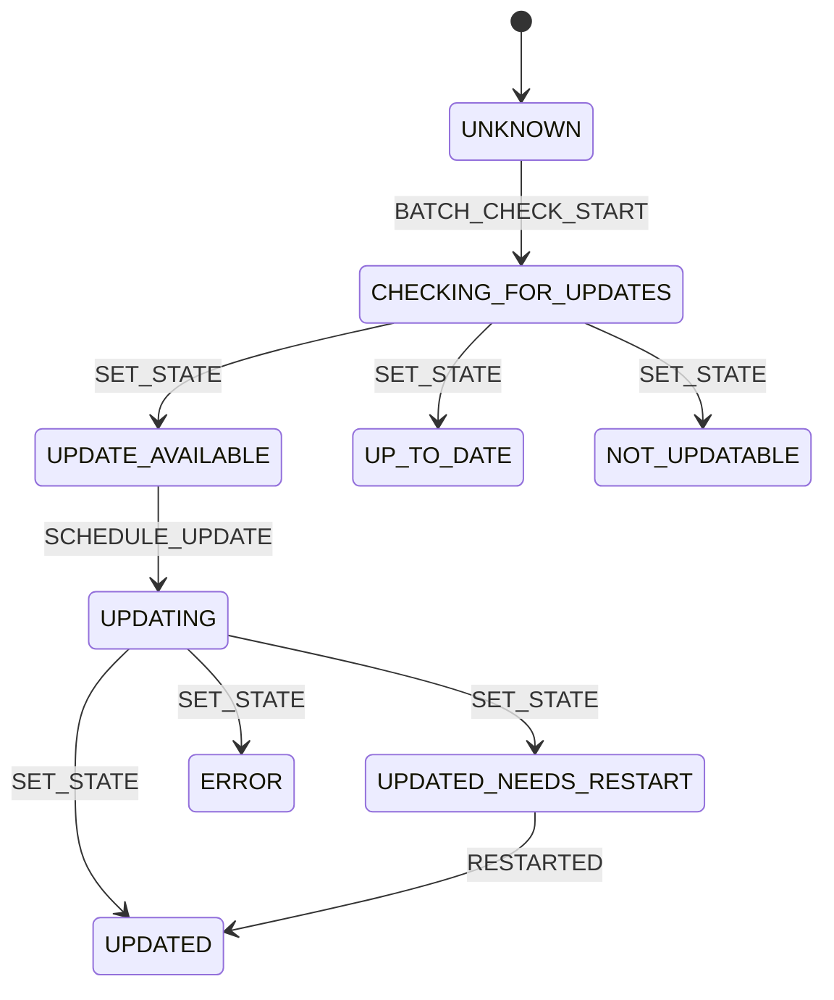

# extensions.ts

> 管理 CLI 扩展更新状态的 Reducer 模式状态管理模块

## 概述

`extensions.ts` 实现了一个基于 Reducer 模式的扩展更新状态管理系统。它定义了扩展更新的完整生命周期状态（检查中、有更新、更新中、已更新需重启等），提供了类型安全的 Action 定义和 Reducer 函数，用于管理多个扩展的并发更新状态、批量检查计数和调度更新合并。

## 架构图（mermaid）



```mermaid
graph TD
    A[ExtensionUpdatesState] --> B[extensionStatuses: Map]
    A --> C[batchChecksInProgress: number]
    A --> D[scheduledUpdate: ScheduledUpdate | null]

    E[ExtensionUpdateAction] --> E1[SET_STATE]
    E --> E2[SET_NOTIFIED]
    E --> E3[BATCH_CHECK_START/END]
    E --> E4[SCHEDULE_UPDATE]
    E --> E5[CLEAR_SCHEDULED_UPDATE]
    E --> E6[RESTARTED]

    F[extensionUpdatesReducer] -->|处理 Action| A
```

## 主要导出

| 名称 | 类型 | 说明 |
|------|------|------|
| `ExtensionUpdateState` | `enum` | 单个扩展的更新状态枚举（8 种状态） |
| `ExtensionUpdateStatus` | `interface` | 扩展状态 + 是否已通知 |
| `ExtensionUpdatesState` | `interface` | 全局扩展更新状态（状态 Map + 批量计数 + 调度更新） |
| `ScheduledUpdate` | `interface` | 调度更新信息（名称列表、是否全部、回调） |
| `ScheduleUpdateArgs` | `interface` | 调度更新请求参数 |
| `ExtensionUpdateAction` | `type` | 7 种 Action 的联合类型 |
| `initialExtensionUpdatesState` | `object` | 初始状态 |
| `extensionUpdatesReducer` | `function` | Reducer 函数 |

## 核心逻辑

1. **SET_STATE**：更新单个扩展的状态，仅在状态变化时创建新 Map（浅比较优化）
2. **SET_NOTIFIED**：标记扩展是否已通知用户更新
3. **BATCH_CHECK_START/END**：递增/递减批量检查计数器
4. **SCHEDULE_UPDATE**：合并调度更新请求，支持多次调度累积（名称列表和回调都会合并）
5. **CLEAR_SCHEDULED_UPDATE**：清除调度更新
6. **RESTARTED**：将 `UPDATED_NEEDS_RESTART` 状态转为 `UPDATED`
7. 使用 `checkExhaustive` 确保所有 Action 类型都被处理

## 内部依赖

| 模块 | 用途 |
|------|------|
| `../../config/extension.js` → `ExtensionUpdateInfo` | 扩展更新信息类型 |

## 外部依赖

| 模块 | 用途 |
|------|------|
| `@google/gemini-cli-core` | `checkExhaustive` 穷尽检查工具 |
