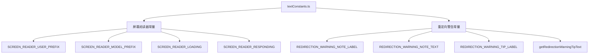

# textConstants.ts

> 定义屏幕阅读器前缀和重定向警告等 UI 文本常量

## 概述

`textConstants.ts` 集中管理 CLI 中使用的文本常量，主要服务于两个场景：屏幕阅读器无障碍支持和命令重定向警告提示。

## 架构图（mermaid）

## 主要导出

| 名称 | 类型 | 说明 |
|------|------|------|
| `SCREEN_READER_USER_PREFIX` | `string` | 屏幕阅读器用户消息前缀 `"User: "` |
| `SCREEN_READER_MODEL_PREFIX` | `string` | 屏幕阅读器模型消息前缀 `"Model: "` |
| `SCREEN_READER_LOADING` | `string` | 屏幕阅读器加载状态文本 |
| `SCREEN_READER_RESPONDING` | `string` | 屏幕阅读器响应状态文本 |
| `REDIRECTION_WARNING_NOTE_LABEL` | `string` | 重定向警告注意标签 |
| `REDIRECTION_WARNING_NOTE_TEXT` | `string` | 重定向警告说明文本 |
| `REDIRECTION_WARNING_TIP_LABEL` | `string` | 重定向警告提示标签（带对齐填充） |
| `getRedirectionWarningTipText` | `function` | 生成包含快捷键提示的重定向警告文本 |

## 核心逻辑

- 所有导出均为简单的字符串常量或字符串生成函数
- `getRedirectionWarningTipText` 接受 `shiftTabHint` 参数，动态生成提示文本

## 内部依赖

无

## 外部依赖

无
