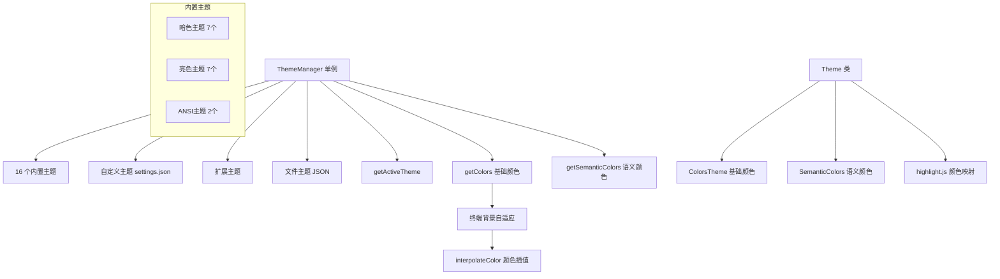

# themes 架构

> 主题系统，提供完整的颜色主题管理，支持内置、自定义和扩展主题

## 概述

`themes` 目录实现了 Gemini CLI 的完整主题系统。它管理 16+ 个内置主题（亮色/暗色/ANSI），支持用户自定义主题（settings.json 或 JSON 文件）和扩展提供的主题。主题系统包含两层颜色体系：基础颜色（ColorsTheme）和语义颜色（SemanticColors），以及终端背景自适应和代码语法高亮映射。

## 架构图



## 目录结构

```
themes/
├── theme-manager.ts      # ThemeManager 单例，主题注册、切换和颜色缓存
├── theme.ts              # Theme 类、ColorsTheme 接口、主题创建和验证、颜色工具
├── semantic-tokens.ts    # SemanticColors 接口定义、亮/暗默认语义颜色
├── color-utils.ts        # 颜色工具函数的重导出和扩展（验证、安全背景、主题切换）
└── builtin/              # 内置主题定义
```

## 关键文件

| 文件 | 功能 |
|------|------|
| `theme-manager.ts` | `ThemeManager` 类：管理活跃主题、加载自定义主题、注册/注销扩展主题、加载文件主题、终端背景自适应颜色计算、颜色缓存 |
| `theme.ts` | `Theme` 类：包含名称、类型、基础颜色、语义颜色、highlight.js 颜色映射。`createCustomTheme` 从用户配置创建主题。`validateCustomTheme` 验证配置。颜色工具：`resolveColor`、`interpolateColor`、`pickDefaultThemeName` |
| `semantic-tokens.ts` | 定义 `SemanticColors` 接口（text/background/border/ui/status 5 类），提供亮/暗两套默认语义颜色 |
| `color-utils.ts` | 扩展颜色工具：`isValidColor` 验证颜色、`getSafeLowColorBackground` 低色终端安全背景、`shouldSwitchTheme` 带滞后的主题切换判断、`parseColor` X11 RGB 解析 |

## 内部依赖

- `../constants` - 不透明度默认值（DEFAULT_BACKGROUND_OPACITY 等）

## 外部依赖

| 包名 | 用途 |
|------|------|
| `tinycolor2` | 颜色解析、转换和亮度计算 |
| `tinygradient` | 两颜色间的渐变插值 |
| `@google/gemini-cli-core` | CustomTheme 类型、debugLogger、homedir |
| `node:fs` | 同步读取主题文件 |
| `node:path` | 路径处理 |
| `node:process` | NO_COLOR 环境变量检测 |
