# builtin 架构

> 内置主题集合，提供 16 个预配置的颜色主题（暗色、亮色和 ANSI 系列）

## 概述

`builtin` 目录包含 Gemini CLI 所有预置的颜色主题。主题按类型分为暗色（dark）、亮色（light）和无颜色（no-color）。每个主题文件创建一个 `Theme` 实例，定义基础颜色配色方案和 highlight.js 语法高亮映射。这些主题由 `ThemeManager` 在启动时注册，用户可通过 `/theme` 命令切换。

## 架构图

```mermaid
graph TD
    ThemeManager[ThemeManager] --> DarkThemes[暗色主题]
    ThemeManager --> LightThemes[亮色主题]
    ThemeManager --> NoColor[无颜色主题]

    DarkThemes --> DefaultDark[Default 默认暗色]
    DarkThemes --> AyuDark[Ayu Dark]
    DarkThemes --> AtomOneDark[Atom One Dark]
    DarkThemes --> DraculaDark[Dracula]
    DarkThemes --> GitHubDark[GitHub Dark]
    DarkThemes --> SolarizedDark[Solarized Dark]
    DarkThemes --> HolidayDark[Holiday Dark]
    DarkThemes --> ShadesOfPurple[Shades of Purple]
    DarkThemes --> AnsiDark[ANSI Dark]

    LightThemes --> DefaultLight[Default Light]
    LightThemes --> AyuLight[Ayu Light]
    LightThemes --> GitHubLight[GitHub Light]
    LightThemes --> GoogleCode[Google Code]
    LightThemes --> SolarizedLight[Solarized Light]
    LightThemes --> XCode[XCode Light]
    LightThemes --> AnsiLight[ANSI Light]

    NoColor --> NoColorTheme[No Color 无色主题]
```



## 目录结构

```
builtin/
├── no-color.ts                        # 无颜色主题（NO_COLOR 环境变量）
├── dark/                              # 暗色主题
│   ├── default-dark.ts                # 默认暗色主题
│   ├── ayu-dark.ts                    # Ayu 暗色主题
│   ├── atom-one-dark.ts               # Atom One Dark 主题
│   ├── dracula-dark.ts                # Dracula 主题
│   ├── github-dark.ts                 # GitHub Dark 主题
│   ├── solarized-dark.ts              # Solarized Dark 主题
│   ├── holiday-dark.ts                # Holiday 主题
│   ├── shades-of-purple-dark.ts       # Shades of Purple 主题
│   └── ansi-dark.ts                   # ANSI 暗色主题（仅用 16 色）
└── light/                             # 亮色主题
    ├── default-light.ts               # 默认亮色主题
    ├── ayu-light.ts                   # Ayu 亮色主题
    ├── github-light.ts                # GitHub Light 主题
    ├── googlecode-light.ts            # Google Code 主题
    ├── solarized-light.ts             # Solarized Light 主题
    ├── xcode-light.ts                 # XCode Light 主题
    └── ansi-light.ts                  # ANSI 亮色主题（仅用 16 色）
```

## 关键文件

| 文件 | 功能 |
|------|------|
| `dark/default-dark.ts` | 默认暗色主题，也是 Gemini CLI 的初始主题（DEFAULT_THEME） |
| `light/default-light.ts` | 默认亮色主题，终端亮色背景时自动切换 |
| `dark/ansi-dark.ts` | ANSI 暗色主题，仅使用终端的 16 色 ANSI 颜色名，兼容性最好 |
| `light/ansi-light.ts` | ANSI 亮色主题，类似 ansi-dark 但适配亮色背景 |
| `no-color.ts` | 无颜色主题，当 NO_COLOR 环境变量存在时使用，所有颜色为空字符串 |

## 内部依赖

- `../theme` - Theme 类、darkTheme/lightTheme/ansiTheme 基础颜色、ColorsTheme 类型
- `../semantic-tokens` - SemanticColors 接口

## 外部依赖

无直接外部依赖。每个主题文件仅依赖父目录的 Theme 类和颜色定义。
