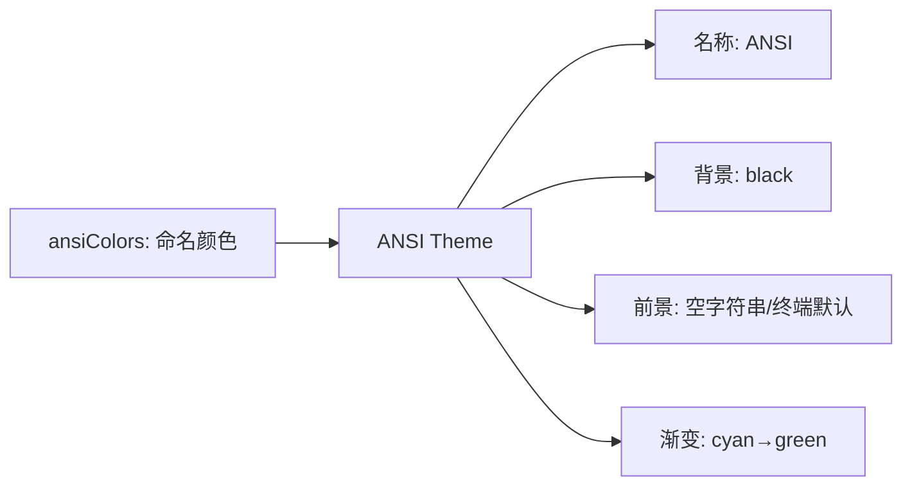

# ansi-dark.ts

> 定义 ANSI 深色主题，仅使用基本 ANSI 颜色名称实现最大终端兼容性

## 概述

`ansi-dark.ts` 导出 `ANSI` 主题实例，使用纯 ANSI 颜色名称（`red`、`green`、`blue` 等）而非 Hex 值。这确保了在任何支持 ANSI 颜色的终端中都能正确显示，颜色的具体外观由终端自身的调色板决定。

## 架构图（mermaid）

## 主要导出

| 名称 | 类型 | 说明 |
|------|------|------|
| `ANSI` | `Theme` | ANSI 深色主题实例 |

## 核心逻辑

- 所有颜色使用 Ink 支持的命名颜色：`blue`、`cyan`、`green`、`yellow`、`red`、`magenta`、`gray`、`white`、`bluebright`
- 前景色为空字符串（使用终端默认色）
- `type` 标记为 `'dark'`（与 ANSI 类型分开）
- 使用 `darkSemanticColors` 作为语义颜色（Hex 值用于语义层面计算）
- Diff 背景使用深 Hex 值（#003300 / #4D0000）
- FocusBackground 设为 `'black'`

## 内部依赖

| 模块 | 用途 |
|------|------|
| `../../theme.js` | `ColorsTheme`, `Theme` |
| `../../semantic-tokens.js` | `darkSemanticColors` |

## 外部依赖

无
