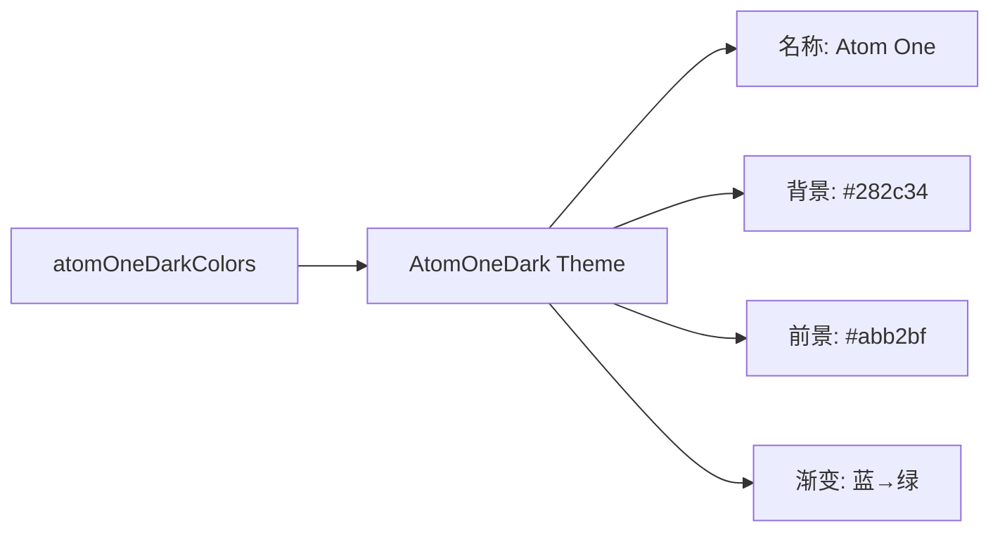

# atom-one-dark.ts

> 定义 Atom One Dark 主题，灵感来自 Atom 编辑器的经典深色配色方案

## 概述

`atom-one-dark.ts` 导出 `AtomOneDark` 主题实例，复刻 Atom 编辑器的 One Dark 配色。以 #282c34 为背景，特征为紫色关键字、红色名称和绿色字符串。

## 架构图（mermaid）

## 主要导出

| 名称 | 类型 | 说明 |
|------|------|------|
| `AtomOneDark` | `Theme` | Atom One Dark 主题实例 |

## 核心逻辑

特色配色：关键字 → AccentPurple (#c678dd)，名称/section → AccentRed (#e06c75)，字符串 → AccentGreen (#98c379)，内置类型 → AccentYellow (#e6c07b)。

## 内部依赖

| 模块 | 用途 |
|------|------|
| `../../theme.js` | `ColorsTheme`, `Theme` |
| `../../color-utils.js` | `interpolateColor` |

## 外部依赖

无
