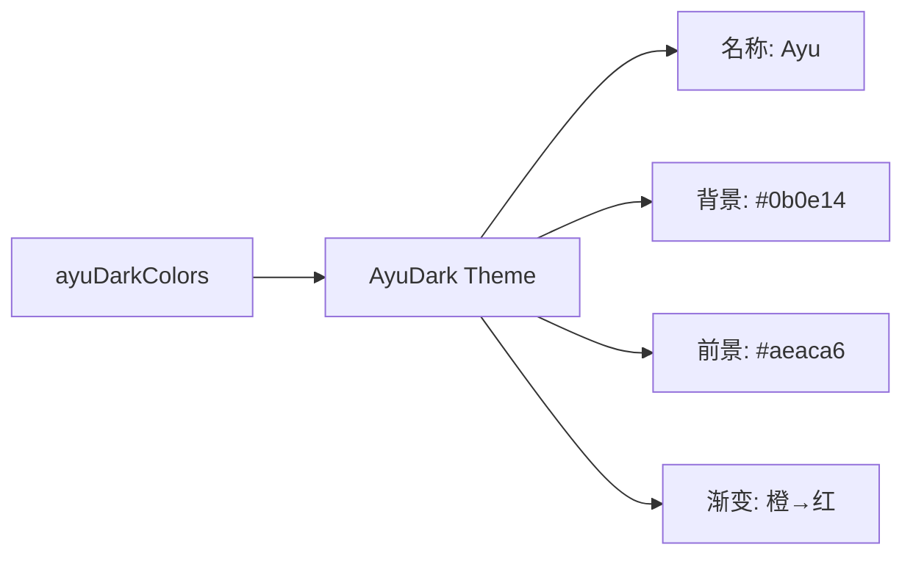

# ayu-dark.ts

> 定义 Ayu 深色主题，灵感来自 Ayu 编辑器配色方案

## 概述

`ayu-dark.ts` 导出 `AyuDark` 主题实例，采用 Ayu 配色方案的深色变体。以极深蓝黑色（#0b0e14）为背景，搭配暖色调的橙黄和冷色调的蓝绿强调色。

## 架构图（mermaid）

## 主要导出

| 名称 | 类型 | 说明 |
|------|------|------|
| `AyuDark` | `Theme` | Ayu 深色主题实例 |

## 核心逻辑

特色配色映射：关键字用 AccentYellow (#FFB454)，字符串用 AccentGreen (#AAD94C)，标题用 AccentYellow。DarkGray 通过 `interpolateColor` 在 Gray 和背景色间 50% 混合。

## 内部依赖

| 模块 | 用途 |
|------|------|
| `../../theme.js` | `ColorsTheme`, `Theme` |
| `../../color-utils.js` | `interpolateColor` |

## 外部依赖

无
