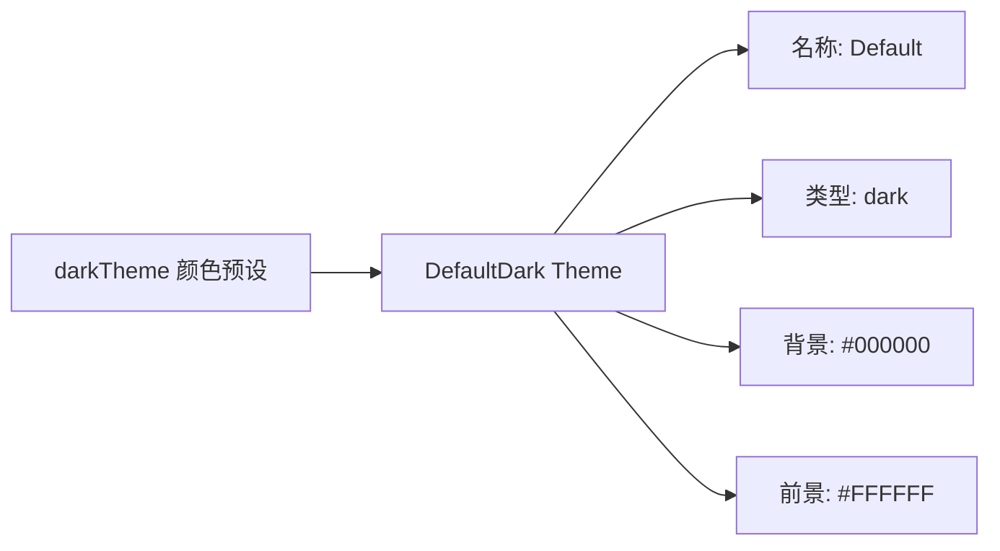

# default-dark.ts

> 定义默认深色主题，作为 CLI 的出厂默认主题

## 概述

`default-dark.ts` 导出 `DefaultDark` 主题实例，使用 `theme.ts` 中预定义的 `darkTheme` 颜色配置。这是 CLI 启动时的默认主题，提供深色背景（黑色）和对比鲜明的代码高亮颜色。

## 架构图（mermaid）

## 主要导出

| 名称 | 类型 | 说明 |
|------|------|------|
| `DefaultDark` | `Theme` | 默认深色主题实例（名称: "Default"） |

## 核心逻辑

基于 `darkTheme` 颜色构建完整的 hljs 代码高亮映射：
- 关键字/字面量/符号 → `AccentBlue` (#87AFFF)
- 内置类型 → `AccentCyan` (#87D7D7)
- 数字/类名 → `AccentGreen` (#D7FFD7)
- 字符串 → `AccentYellow` (#FFFFAF)
- 正则/模板标签 → `AccentRed` (#FF87AF)
- 注释 → `Comment` (#AFAFAF)
- 变量 → `AccentPurple` (#D7AFFF)

## 内部依赖

| 模块 | 用途 |
|------|------|
| `../../theme.js` | `darkTheme`, `Theme` |

## 外部依赖

无
