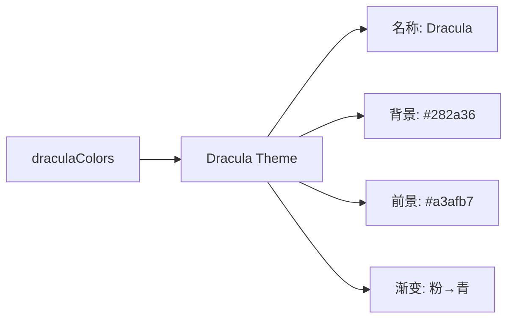

# dracula-dark.ts

> 定义 Dracula 深色主题，灵感来自流行的 Dracula 配色方案

## 概述

`dracula-dark.ts` 导出 `Dracula` 主题实例，采用 Dracula 的标志性紫蓝色调。以 #282a36 为背景，特征为明亮的青色关键字、黄色字符串和粉色函数关键字。

## 架构图（mermaid）

## 主要导出

| 名称 | 类型 | 说明 |
|------|------|------|
| `Dracula` | `Theme` | Dracula 深色主题实例 |

## 核心逻辑

特色配色：关键字 → AccentCyan (#8be9fd)，字符串/标题 → AccentYellow (#fff783)，函数关键字 → AccentPurple (#ff79c6)，加粗关键字和类型名。

## 内部依赖

| 模块 | 用途 |
|------|------|
| `../../theme.js` | `ColorsTheme`, `Theme` |
| `../../color-utils.js` | `interpolateColor` |

## 外部依赖

无
