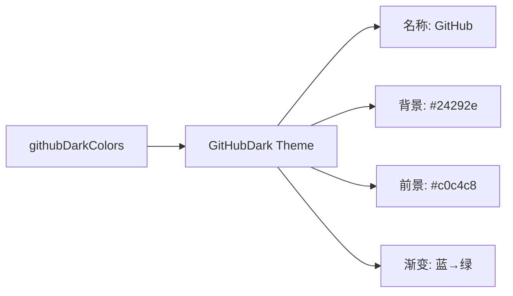

# github-dark.ts

> 定义 GitHub Dark 主题，灵感来自 GitHub 的深色代码查看器配色

## 概述

`github-dark.ts` 导出 `GitHubDark` 主题实例，模拟 GitHub 深色模式的代码高亮配色。以 #24292e 为背景，使用柔和的蓝绿紫色系。

## 架构图（mermaid）

## 主要导出

| 名称 | 类型 | 说明 |
|------|------|------|
| `GitHubDark` | `Theme` | GitHub 深色主题实例 |

## 核心逻辑

特色配色：关键字 → AccentRed (#F97583) 加粗，标题 → AccentPurple (#B392F0) 加粗，字符串 → AccentCyan (#9ECBFF)，类型 → AccentGreen (#85E89D) 加粗。Diff 带背景色。

## 内部依赖

| 模块 | 用途 |
|------|------|
| `../../theme.js` | `ColorsTheme`, `Theme` |
| `../../color-utils.js` | `interpolateColor` |

## 外部依赖

无
