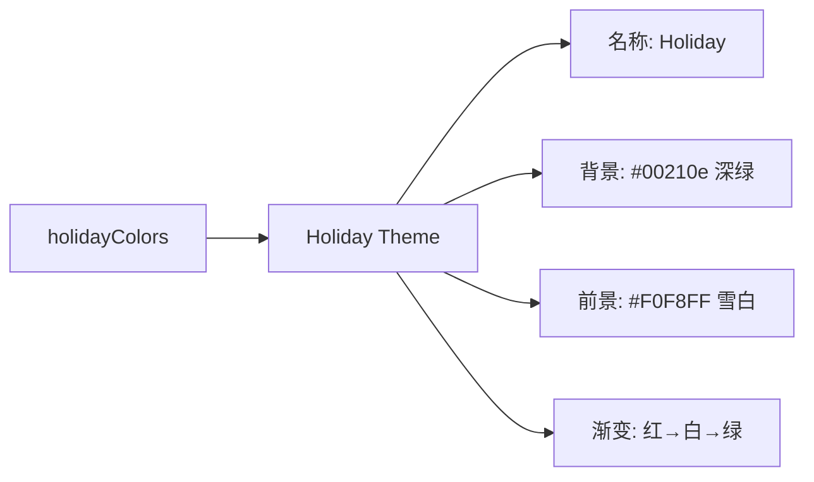

# holiday-dark.ts

> 定义 Holiday 节日深色主题，采用红绿白经典节日配色

## 概述

`holiday-dark.ts` 导出 `Holiday` 主题实例，这是一个季节性/彩蛋主题，使用深绿色背景（#00210e）搭配红绿白节日色彩。渐变色为红→白→绿，FocusColor 使用霓虹青色营造节日氛围。

## 架构图（mermaid）

## 主要导出

| 名称 | 类型 | 说明 |
|------|------|------|
| `Holiday` | `Theme` | Holiday 节日主题实例 |

## 核心逻辑

特色配色：以圣诞节色彩为主题，关键字/数字 → AccentGreen (#3CB371)，字符串 → AccentYellow (#FFEE8C)，FocusColor → AccentCyan (#33F9FF) 霓虹青色。

## 内部依赖

| 模块 | 用途 |
|------|------|
| `../../theme.js` | `ColorsTheme`, `Theme` |
| `../../color-utils.js` | `interpolateColor` |

## 外部依赖

无
