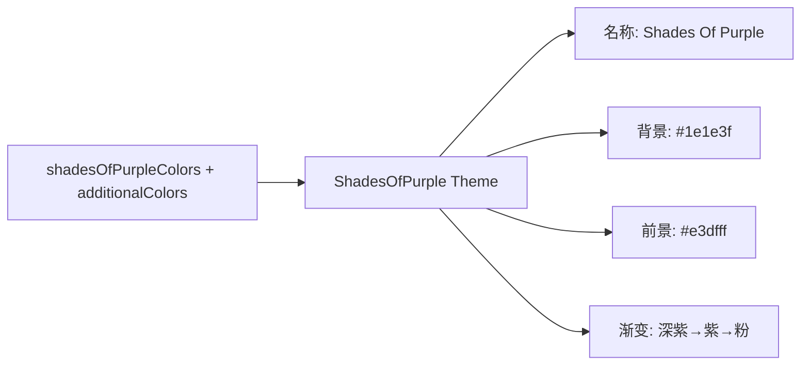

# shades-of-purple-dark.ts

> 定义 Shades Of Purple 深色主题，基于 Ahmad Awais 的同名 VS Code 主题

## 概述

`shades-of-purple-dark.ts` 导出 `ShadesOfPurple` 主题实例，这是所有内置主题中映射最丰富的一个（约 350 行）。以深紫蓝色（#1e1e3f）为背景，使用大量紫色色调变体和鲜艳的对比色。额外定义了 `additionalColors` 提供超出 ColorsTheme 接口的橙色、粉色、浅紫色等。

## 架构图（mermaid）

## 主要导出

| 名称 | 类型 | 说明 |
|------|------|------|
| `ShadesOfPurple` | `Theme` | Shades Of Purple 主题实例 |

## 核心逻辑

特色配色：
- 关键字/内置 → AccentOrange (#fb9e00)
- 字符串/符号/正则 → AccentGreen (#A5FF90)
- 注释 → AccentPurple (#ac65ff)
- 数字 → AccentPink (#fa658d)
- 参数 → AccentLightPurple (#c991ff) 斜体
- 操作符 → AccentDarkPurple (#6943ff)
- 包含语言专属样式（Python 装饰器、Ruby 符号、SQL 关键字、Markdown 标题等）

## 内部依赖

| 模块 | 用途 |
|------|------|
| `../../theme.js` | `ColorsTheme`, `Theme` |
| `../../color-utils.js` | `interpolateColor` |

## 外部依赖

无
