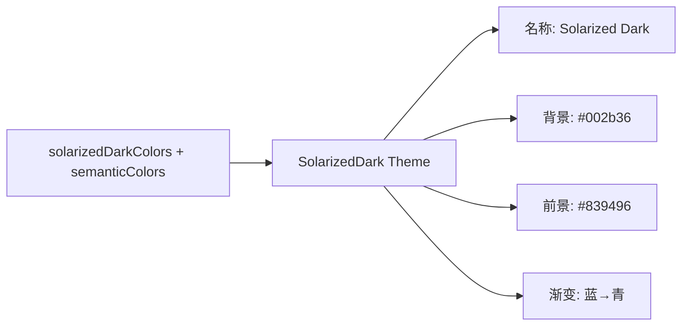

# solarized-dark.ts

> 定义 Solarized Dark 主题，基于 Ethan Schoonover 的 Solarized 配色方案暗色变体

## 概述

`solarized-dark.ts` 导出 `SolarizedDark` 主题实例，忠实还原 Solarized 配色方案的深色版本。以深蓝绿色（#002b36）为背景，提供精心调校的自定义 `SemanticColors`。这是少数提供自定义语义颜色的内置主题之一。

## 架构图（mermaid）

## 主要导出

| 名称 | 类型 | 说明 |
|------|------|------|
| `SolarizedDark` | `Theme` | Solarized Dark 主题实例 |

## 核心逻辑

- 使用 Solarized 标准色：base03 (#002b36) 到 base3 (#fdf6e3)
- 自定义 `SemanticColors` 指定 message/input 背景为 #073642（base02）
- focus 背景使用 `interpolateColor` 与 AccentGreen (#859900) 混合
- Diff 使用自定义深色背景（#00382f / #3d0115）

## 内部依赖

| 模块 | 用途 |
|------|------|
| `../../theme.js` | `ColorsTheme`, `Theme`, `interpolateColor` |
| `../../semantic-tokens.js` | `SemanticColors` |
| `../../../constants.js` | `DEFAULT_SELECTION_OPACITY` |

## 外部依赖

无
